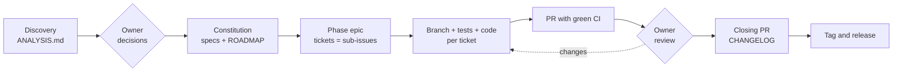

# sdd-kit

[](https://github.com/fabiodrneles/sdd-kit/actions/workflows/ci.yml)
[](LICENSE)
[Português](README.md)

**Spec Driven Development from the first commit to the release**, driven by [Claude Code](https://claude.com/claude-code) and delivered the way a professional team delivers: specs with acceptance criteria, one epic per phase, one ticket per task, one branch and one PR per ticket, green CI, review, CHANGELOG and tag.

> **The owner decides, the agent executes.** You answer the decisions and review the PRs; the agent analyzes, specifies, opens the tickets, writes code and tests and keeps CI green.


*Adoption in an empty repository and the first `make ci`, with real output ([how it was generated](docs/demo/demo.sh)).*

The kit comes from [cv-craft](https://github.com/fabiodrneles/cv-craft), which went from prototype to `v1.x` with this process ([case study](docs/case-study.en.md)), and sdd-kit itself is built with it ([specs](specs/README.md), [epic #1](https://github.com/fabiodrneles/sdd-kit/issues/1)). To see the process in a project built from scratch, with epic, tickets, PRs and a release, open [sdd-kit-demo](https://github.com/fabiodrneles/sdd-kit-demo). This repository's specs, issues and pull requests are written in Portuguese; code and commits are in English. The skill itself is in English and writes specs, issues and PRs in the owner's language, read from `CLAUDE.md`/`AGENTS.md` or asked once.

## What is in the kit

| Part | Purpose | Spec |
|---|---|---|
| `sdd-delivery` skill | Teaches the agent the whole process: evidence-based analysis, specs, epics, PRs, root-causing red CI, review, phase closing and release. Written in English, it writes specs, issues and PRs in the owner's language | [002](specs/002-skill-plugin/spec.md) |
| `template/` | `CLAUDE.md`, session hook, issue and PR templates, `CONTRIBUTING.md`, `CHANGELOG.md`, `specs/` skeleton and ready-made CI for **Go, Node/TS, Java, Python, Rust and C#/.NET** | [003](specs/003-template/spec.md) |
| Adoption script | Copies the template into a new or existing repository **without overwriting anything**; sh and PowerShell | [004](specs/004-adoption-script/spec.md) |

## How it works



| Step | Who | What lands in the repository |
|---|---|---|
| Discovery | Agent | `specs/ANALYSIS.md`: what was verified (command → result), findings by severity with evidence, open decisions D1..Dn with a recommendation |
| Decisions | **Owner** | Answers recorded in the specs; nothing is implemented before |
| Specs | Agent | `specs/constitution.md` (verifiable principles), one spec per area with `FR-*`, `NFR-*` and `AC-*` (Given/When/Then), `ROADMAP.md` by phases (the version comes from go-release-manager at closing) |
| Planning | Agent | One epic per phase and one ticket per task, as native GitHub sub-issues |
| Implementation | Agent | One branch and one PR per ticket; every `AC-*` becomes a test; `make ci` green before every push |
| Review and merge | **Owner** | Review in the epic's order; the agent answers and fixes |
| Closing | Agent → **Owner** | Closing PR (spec status, ROADMAP, CHANGELOG); the owner creates the tag and the workflow publishes the release |

**Work state lives on GitHub**, not in the chat: the epic keeps a "phase status" comment with PRs, CI, decisions and the next step. A new session reads that comment and resumes where the last one stopped.

## Starting a new repository

In about 5 minutes the kit is installed and the agent is working on your project.

**You need:** git, a GitHub repository and [Claude Code](https://claude.com/claude-code) installed. For CI to pass on your machine, also the project's language.

1. Create the repository on GitHub and clone it.
2. In the project folder, install the kit, replacing `go` with the project's language (`node`, `java`, `python`, `rust` or `dotnet`):

   ```text
   curl -fsSL https://raw.githubusercontent.com/fabiodrneles/sdd-kit/v1.23.5/scripts/adopt.sh | sh -s -- --lang go .
   ```

   The command copies into the repository:

   - the agent instructions (`CLAUDE.md` and `AGENTS.md`);
   - the `specs/` folder, where planning and decisions live, and `CHANGELOG.md`;
   - ready-made CI for the language (lint, tests with minimum coverage and build) and the `Makefile` with `make ci`;
   - issue and PR templates and the hook that prepares Claude Code sessions on the web.

   **It never overwrites a file you already have** and lists at the end what it created and what it skipped. To only see what it would do, without writing anything, add `--dry-run`:

   ```text
   curl -fsSL https://raw.githubusercontent.com/fabiodrneles/sdd-kit/v1.23.5/scripts/adopt.sh | sh -s -- --lang go --dry-run .
   ```

   In an empty repository, `--skeleton` also creates a minimal project with one test, so the first CI run is already green.

3. Commit what was created and open Claude Code in the project folder.
4. Ask: *"use the sdd-delivery skill: create the constitution, specs and ROADMAP for my idea: …"*. The agent proposes the open decisions and **stops** until you answer.
5. After answering: *"create the Phase 1 epic with its tickets and go ticket by ticket"*. Every task becomes a small PR with green CI for you to review.

## Adopting in an existing repository

Same script, built not to break anything:

- existing files (`README.md`, `CLAUDE.md`, CI…) are **never overwritten** without `--force`; the report lists what was created and what was skipped;
- `--dry-run` shows everything before writing;
- running it again changes nothing (idempotent).

```text
cd my-repo
sh /path/to/sdd-kit/scripts/adopt.sh --lang node --dry-run .
sh /path/to/sdd-kit/scripts/adopt.sh --lang node .
```

Then ask the agent for the **discovery phase**: *"use the sdd-delivery skill: analyze and verify this repository"*. It reads the code, runs what the README promises, records evidence-backed findings in `specs/ANALYSIS.md` and proposes decisions. From there the flow is the same as for a new repository.

### How the skill reaches each repository

The skill is **not copied** into repositories. It is published as a Claude Code plugin from this repository, and each project only declares that it uses it:

```json
{
  "extraKnownMarketplaces": {
    "sdd-kit": { "source": { "source": "github", "repo": "fabiodrneles/sdd-kit" } }
  },
  "enabledPlugins": { "sdd-delivery@sdd-kit": true }
}
```

Repositories adopted by the script get this configuration; if yours already had a `.claude/settings.json`, the script leaves it alone and you only add the two keys above. An improvement to the skill made here reaches every repository, with no diverging copies. What belongs to the project (specs, `CLAUDE.md`, CI) stays in the project.

## Where the gain is

| Common problem with agents | How the kit handles it |
|---|---|
| The agent "forgets" the project every session and rereads everything | `CLAUDE.md` with map and pitfalls + the epic's status comment: resuming reads one comment, not the whole repository |
| The session ends mid-task (usage limit, full context) and the work is lost | **Resume checkpoints:** after every step the agent records on the epic where it stopped (branch, commit, PRs, next step); the next session reads it on start and carries on, with nothing for you to explain |
| Tokens spent on reading and validation | The skill tells the agent to read excerpts, ask CI only for summaries and validate with one command (`make ci`) |
| Code that "looks done" but misses the request | Verifiable acceptance criteria; every `AC-*` becomes a test; each new test is mutation-checked |
| Huge PRs that are hard to review | One ticket = one branch = one PR, with a review order in the epic |
| Red CI "fixed" by disabling tests | Explicit rule: root cause, never skip a test or loosen a gate |
| Decisions made by the agent behind your back | Stop points: decisions, review, merge and tag belong to the owner |
| A long session that rereads the whole conversation on every call | **Short-session relay:** one fresh agent per ticket, starting with only the ticket's pack (see below) |

## Why sdd-kit

The community already has great SDD tools, each strong at something:

| Tool | Best at | Focus |
|---|---|---|
| [spec-kit](https://github.com/github/spec-kit) (GitHub) | New projects and teams that want a standard flow | `constitution` → `specify` → `plan` → `tasks` → `implement`, for many agents |
| [OpenSpec](https://github.com/Fission-AI/OpenSpec) | Changes to existing code | Change proposals with deltas (`ADDED`/`MODIFIED`/`REMOVED`) archived into the specs |
| [Kiro](https://github.com/kirodotdev/Kiro) (AWS) | Integrated IDE experience | `requirements.md` in EARS notation, `design.md`, `tasks.md` and hooks |
| [BMAD Method](https://github.com/bmad-code-org/BMAD-METHOD) | Large and regulated projects | A simulated agile team with roles (analyst, PM, architect, QA…) |

**sdd-kit** covers the stretch those tools leave to you: **delivery**. The spec becomes an epic and tickets on GitHub, every ticket becomes a reviewable PR with green CI, the phase closes with a CHANGELOG and the release comes from a tag — with clear roles (the owner decides), **resume checkpoints** (close the session at any time; the next one continues on its own from where the last stopped) and ready-made CI per language. And the kit brings in their best ideas ([spec 006](specs/006-community-features/spec.md)): EARS criteria (Kiro), `ADDED`/`MODIFIED`/`REMOVED` deltas per spec (OpenSpec), AC → test traceability checks and slash commands (spec-kit), and `AGENTS.md` for other agents.

## Commands and checks

With the plugin installed, every step of the flow has a command: `/sdd-analyze` (discovery), `/sdd-specs` (constitution, specs, ROADMAP), `/sdd-epic <phase>` (epic and tickets), `/sdd-next` (next ticket to a green PR), `/sdd-status` (phase status comment, to resume in any session) and `/sdd-close <version>` (phase closing PR; the tag stays with the owner).

In adopted repositories:

- **`make ci`**: the same check as the language CI, with minimum coverage.
- **Release tag workflow**: *Actions → Release tag → Run workflow* creates the tag (computed from Conventional Commits by [go-release-manager](https://github.com/fabiodrneles/go-release-manager), or the ROADMAP one in `release-as`) and publishes the release with generated notes.
- **`make sdd-check`**: traceability. Every acceptance criterion of an `In Progress`/`Done` spec must be cited in a test as `NNN AC-n`, spec status must match the index and the ROADMAP may only cite existing IDs. CI and `make sdd-check` run it with `--strict`, so any warning blocks the merge.
- **`make linkcheck`** (broken links in `.md` files, with lychee) and **`scripts/doc-commands.sh`**, which runs in CI the README `bash` blocks marked with `<!-- doc-commands -->`.
- **Accessibility in the Node template:** with `A11Y_PAGES := dist/index.html`, `make ci` runs axe on those pages and fails on any violation.
- Acceptance criteria in Given/When/Then or **EARS**, a **"Mudanças"** (changes) section per spec feeding the CHANGELOG, and **`AGENTS.md`** for Codex, Copilot, Cursor and other agents.

### Token-saving scripts

Adoption also brings scripts for the mechanical steps of the process. The agent calls a script and reads one line per result instead of running dozens of steps and reading long outputs: `sdd-ci.sh` (wait for CI, show only the tail of failed logs), `sdd-wait.sh pr-merged|ci|issue-closed TARGET` (wait with no LLM for a PR merge, CI or an issue to close; one line at the end and an exit code: 0 held, 1 failed, 2 timed out; for background waiting, never a hand-written loop), `sdd-pr.sh` (ship the ticket branch: merge main, `make ci`, push, open or reuse the PR, wait for its CI, save the checkpoint), `sdd-release.sh [X.Y.Z]` (prepare the version's closing PR, with the version computed by go-release-manager; X.Y.Z only forces it: CHANGELOG draft from merged PRs, version bumps listed in `.sdd-release`, commit and PR; `--tag` after the merge dispatches the Release tag workflow or pushes the tag), `sdd-doctor.sh [--check]` (check and fix the local environment so `make ci` behaves like CI: pinned tool versions, Go `covdata`, a stale `golangci-lint` shadowing the right one on PATH, UTF-8 locale; one line per item, `--check` only reports), `sdd-mark.sh decide|close` (status files for decisions and phase closing), `sdd-phase-status.sh` (the epic's "Estado da fase" comment), `sdd-epic.sh` (phase epic and sub-issue tickets), `sdd-checkpoint.sh save|show` (resume checkpoint on the epic, so a new session picks up where the last one stopped), `sdd-resume.sh` (the whole resume routine in one command: checkpoint, branch, open PRs with CI, open epic issues) and, for Go, `sdd-release-check.sh pre|post` (simulate the release before tagging; verify the published release).

## Short-session relay

`scripts/sdd-relay.sh` works the open epic ticket by ticket, with no LLM in between. For each ticket it starts a fresh agent that begins with only the `scripts/sdd-context.sh` pack (the issue, the cited spec lines and the likely files), waits for the PR merge and moves to the next one. A short session rereads little context on each call; a long session rereads the whole conversation.

```sh
sh scripts/sdd-relay.sh --dry-run   # shows the next ticket and its pack, without calling the agent
sh scripts/sdd-relay.sh --max 1     # one ticket, then stop
sh scripts/sdd-relay.sh             # the whole epic, until the phase closes or a stop
```

- **Where:** on a machine or session with `claude` and `gh` authenticated, at the repository root. The default agent is `claude -p` with no permission prompts and only the delivery commands; `SDD_AGENT_CMD` swaps the agent.
- **Stops:** the relay stops and comments on the epic when the Next step is "ask the owner", when the PR's CI fails twice in a row and when the `SDD_BUDGET_TOKENS` budget runs out. `SDD_SESSION_MAX_TOKENS` (default 150000) caps each session's context. To interrupt, press Ctrl+C: run again, it resumes from GitHub.
- **Cost:** the relay records each ticket's exact cost on its issue, and `scripts/sdd-report.sh phase '#EPIC'` compares tickets with and without the relay.

## Event-driven engine

Every PR event (CI, merge, conflict) used to wake the agent's session and reload the whole conversation for a mechanical step. Adoption brings workflows that do those steps with no LLM; the agent opens the PR (`sdd-pr.sh --no-wait`), saves the checkpoint and ends the reply, and comes back only for judgment (code, root cause, a real conflict, review).

| Event | Workflow | What it does, with no LLM |
|---|---|---|
| Ticket PR merged | `sdd-on-merge.yml` | Updates the epic's checkpoint: done is the PR, next is the lowest open sub-issue |
| A PR's CI finishes | `sdd-ci-summary.yml` | Keeps a single comment with one line per check and the tail of failed logs; turns "green" when it passes |
| `main` changes | `sdd-update-prs.yml` | Merges `main` into open PRs behind it and warns once the ones with a real conflict |
| Last epic ticket closed | `sdd-on-phase-done.yml` | Opens the version's closing PR (`sdd-release.sh`) |
| Closing PR merged | `sdd-on-release-merge.yml` | Dispatches the version's release exactly once (`sdd-release.sh --tag`) |

All are idempotent, use only the `GITHUB_TOKEN` (or the optional secret below), no LLM secrets, and act only on PRs from the repository itself. `sdd-wait.sh` covers whatever is left to wait for in a shell. The sdd-kit itself runs this engine (`make self-sync` generates its workflows from the template and CI fails if they drift).

Repository setup:

1. **Required for the automatic closing PR and for `sdd-sync`:** *Settings → Actions → General → Workflow permissions* → enable **"Allow GitHub Actions to create and approve pull requests"**. Without it, `sdd-on-phase-done` cannot open the closing PR and `sdd-sync` fails with "GitHub Actions is not permitted to create or approve pull requests".
2. **Optional:** the `SDD_ENGINE_TOKEN` secret, a fine-grained token with write access to *Contents* and *Pull requests*. Pushes and PRs made with the `GITHUB_TOKEN` do not trigger CI. Without the secret, the engine dispatches CI itself (`workflow_dispatch`) on each PR branch it updates; with the secret, the push itself triggers it.
3. **Turn off:** the repository variable `SDD_ENGINE=off` disables every engine workflow (none reads or writes anything).
4. **CI name:** the summary listens to the workflow named `CI`. If the project renamed it, rename it back or adjust `workflows:` in `sdd-ci-summary.yml`.

**Auto merge:** `sh scripts/sdd-auto-merge.sh on` turns it on, `off` turns it off (the default) and `status` shows it; or ask the agent. On, every PR with green CI and no conflict is merged on its own, the relay's too, and the engine carries on with the checkpoint, the phase and the release.

## Automatic updates

Adoption writes `.sdd-kit.json` (kit version and a hash per managed file). Every Monday the `sdd-kit sync` workflow compares it with the latest release and opens **one PR**: untouched files are updated, files the kit did not change stay as they are, files both you and the kit changed get the new version and are listed under **"Conflitos"** for you to decide in the PR, files that are only yours are never touched, and `specs/` and `CHANGELOG.md` belong to the project: the kit creates them on adoption if missing and never changes them again. When the new version creates or changes files under `.github/workflows/`, the `GITHUB_TOKEN` cannot push them (it never gets the `workflows` permission). Without the **`SDD_SYNC_TOKEN`** secret (a fine-grained token with write access to *Contents*, *Pull requests* and *Workflows*; `SDD_ENGINE_TOKEN` works too if it has *Workflows*), the PR carries everything except those workflows and its description lists them: configure the secret, or run `sh scripts/sdd-sync.sh --only-workflows` on the PR branch and push. Enable *Settings → Actions → General → "Allow GitHub Actions to create and approve pull requests"*; without it the job pushes the `sdd-kit/sync` branch, writes the link to open the PR in the job summary and ends with a warning instead of failing. If you adopted up to `v1.3.0` and the sync fails with `Syntax error`, the old script was overwriting itself while running: run a copy of it once, from the repository root, and open the PR with the result (`cp scripts/sdd-sync.sh /tmp/sdd-sync.sh && sh /tmp/sdd-sync.sh`). From `v1.3.1` on, the script does this itself.

## axyn

**axyn** brings the process to [opencode](https://opencode.ai) with free or local models: you describe what you want, it writes the spec, opens the tickets and delivers **one PR per ticket**, moving on only when the gates pass (the project's `make ci`, loosened or deleted tests, protected files and diff size). It is a single binary with no dependencies.

Never used a terminal? Follow the [step by step for beginners](#step-by-step-for-beginners).

**1. Install, one command.** Inside the project's cloned repository (the binary goes to `~/.local/bin`; without Go it downloads from the release and checks the sha256, and at the end it runs `axyn install` to set up opencode):

```text
curl -fsSL https://raw.githubusercontent.com/fabiodrneles/sdd-kit/main/scripts/install-axyn.sh | sh
```

On Windows (PowerShell), inside the repository, the binary goes to `%LOCALAPPDATA%\axyn` and `axyn install` also runs at the end:

```text
irm https://raw.githubusercontent.com/fabiodrneles/sdd-kit/main/scripts/install-axyn.ps1 | iex
```

**2. Set up a free model in opencode.** The key lives only in an environment variable, never in a repository file. With [OpenRouter](https://openrouter.ai), export `OPENROUTER_API_KEY`, open opencode and pick a model ending in `:free` in `/models`. To run locally, use [Ollama](https://ollama.com) and opencode's Ollama provider.

**3. Pick the model.** Run `axyn model` and pick by number from the list of free ones (or `axyn model ID`). The ladder, optional: in `~/.config/axyn/config.yaml`, an ordered list: if a model does not pass the gates, axyn tries the next one. `key_env` is the variable's name, never the key (a literal key in the file is refused):

```yaml
models:
  - id: openrouter/qwen/qwen3-coder:free
    key_env: OPENROUTER_API_KEY
  - id: ollama/qwen2.5-coder
```

**4. Run.** In opencode, inside the repository:

```text
/axyn build a landing page
```

axyn writes the spec, opens the tickets, implements each on its own branch, runs the gates and opens one PR per ticket; merging stays with you. To follow progress (ticket, gates, model and attempts), run `axyn status` in a terminal.

**No CI in the project? axyn sets it up.** In an empty repository or one without `make ci`, before the first ticket axyn applies the stack's template (detected from the files, or from the request in an empty repository: a landing page means `web`) with the `Makefile`, the GitHub CI and the lint, in a commit of its own, without changing existing files. When it cannot tell the stack, it asks; when a tool is missing (`make`, `node`…), it stops right away and says what to install. To do it by hand: `axyn init` (or `axyn init --stack python`).

**Something went wrong? Run `axyn history`** (or ask in opencode "save the axyn history"): it writes to one file everything the run did, with the request, the plan, each attempt and why it failed, the questions and answers, the commits, the environment and the full log. Keys and tokens are removed. The file goes to `.axyn/` (out of git), or to any folder with `axyn history --out ~/Downloads/axyn_history.md`. Just attach it when asking for help.

### What the repository needs

Run `axyn doctor` in the repository: it checks each item below, one line per item, and prints the command for each one missing. `axyn setup` configures everything it can on its own, through `gh` (the installer already runs `doctor` at the end).

| Item | Why | `axyn setup` | By hand |
|---|---|---|---|
| `gh` installed and logged in | axyn opens the PRs and configures GitHub through it | prints your system's install command | `gh auth login` (only you: it opens the browser) |
| git identity | the tickets' commits | uses your GitHub account's name and `noreply` e-mail, in this repository only | `git config --global user.name "Your Name"` and `user.email` |
| Repository on GitHub (`origin`) | push and one PR per ticket | private `gh repo create`, pushing the current branch | create it on GitHub and `git remote add origin ...` |
| GitHub Actions with write access | CI runs on every PR, and the sdd-kit engine comments and opens PRs | enables it and gives the `GITHUB_TOKEN` write access and permission to open PRs | *Settings → Actions → General → Workflow permissions* |
| Auto-merge and branch deleted after merge | merging without waiting, and a clean repository | turns both on | *Settings → General → Pull Requests* |
| Protection of the main branch (optional) | only what passed `make ci` reaches `main` | with `axyn setup --protect-main` (the free plan has none on private repositories: it warns and goes on) | *Settings → Branches* |
| The stack's `make ci` tools (`make`, `node`…) | the gates run `make ci` on your machine | prints the full command to paste (`apt`, `dnf`, `pacman`, `brew` or `winget`) | install with the system's package manager |
| `opencode` and a model | where `/axyn` runs | prints the install command | the model key only in an environment variable |

## Step by step for beginners

From a freshly opened terminal to your first PR merged with axyn. Each step has the command for **Linux/macOS** and for **Windows (PowerShell)**. Copy, paste and press Enter. Lines starting with `#` are explanations; you do not need to type them.

> **This is the order, and it matters:**
>
> 1. **Close opencode**, if it is open (`Ctrl + C` or `/exit`).
> 2. Do **steps 1 to 7 in the terminal** (PowerShell, on Windows), **with opencode closed**. Type the commands yourself, in the terminal; do not ask opencode's AI to run them: each command opencode runs is a separate process, and what it changes (like the PATH) does not last.
> 3. **Only at step 8 open opencode**, already inside the project folder, and ask for the task with `/axyn`.

**How to tell where you are:**

| You are in… | What you see | What to type there |
|---|---|---|
| **The terminal** (PowerShell, on Windows) | a line like `PS E:\projects\my-site>` (Windows) or `you@pc:~/my-site$` (Linux/macOS), with the cursor blinking at the end | the commands of steps 1 to 7, and `axyn status` |
| **opencode** | a full screen with the conversation and, at the bottom, the bar with the model (e.g. `Build · Nemotron 3 Ultra Free`) | only `/models` and `/axyn ...` (step 8). Pasting a terminal command there makes the AI talk about it, but it does not run it properly |

To leave opencode and go back to the terminal: `Ctrl + C` (twice, if needed) or `/exit`.

### 1. Open the terminal

- **Windows:** Windows key, type `PowerShell` and open **Windows PowerShell** (or **Terminal**).
- **macOS:** `Cmd + Space`, type `Terminal` and press Enter.
- **Linux:** `Ctrl + Alt + T`.

### 2. Install the tools

There are four: **git** (versions the code), **gh** (talks to GitHub), **node** (runs opencode and checks the HTML) and **make** (runs `make ci`, which the gates use). Your project's language (Go, Python, Java…) and its linter are only needed if the project is in it; do not install anything else now: `axyn doctor` at step 7 says exactly what **your** project is missing, with the command to paste.

Ubuntu/Debian:

```bash
sudo apt-get update && sudo apt-get install -y git make curl nodejs npm gh
```

macOS (the first command installs git and make; the second installs Homebrew, if you do not have it yet):

```bash
xcode-select --install
/bin/bash -c "$(curl -fsSL https://raw.githubusercontent.com/Homebrew/install/HEAD/install.sh)"
brew install gh node
```

Windows (close and reopen PowerShell afterwards, so it finds the new programs):

```powershell
winget install -e --id Git.Git
winget install -e --id GitHub.cli
winget install -e --id OpenJS.NodeJS.LTS
winget install -e --id ezwinports.make
```

Check that it worked (each command prints a version; if one says "not found", install it again):

```bash
git --version
gh --version
node --version
make --version
```

### 3. Log in to GitHub

If you have no account yet, create one at <https://github.com> (**Sign up** button, top right). Then:

```bash
gh auth login
# Answer: GitHub.com → HTTPS → Yes → Login with a web browser.
# It shows a code; the browser opens; paste the code and authorize.
```

Tell git your name and e-mail (they show in the commits; `axyn setup` in step 7 also does it for you, from your account):

```bash
git config --global user.name "Your Name"
git config --global user.email "you@example.com"
```

### 4. Install opencode and pick a free model

**opencode** is the program where you talk to the AI in the terminal. The **model** is the AI itself; here we use a free model from **OpenRouter**, a site that gives access to many models with a single account.

#### 4.1. Install opencode

Linux/macOS:

```bash
curl -fsSL https://opencode.ai/install | bash
```

Windows:

```powershell
npm install -g opencode-ai
```

Close and reopen the terminal, and check (it should print a version number):

```bash
opencode --version
```

#### 4.2. Create the OpenRouter account

1. Open <https://openrouter.ai> in the browser.
2. Click **Sign up** (top right corner) and sign in with your Google or GitHub account, or with an e-mail. No card is needed for the free models.

#### 4.3. Create the key (the "password" opencode uses to talk to OpenRouter)

1. Logged in, open <https://openrouter.ai/settings/keys> (or click your picture, top right, then **Keys**).
2. Click **Create Key**. Under **Name**, type `axyn`; leave the rest as is and click **Create**.
3. A key starting with `sk-or-v1-...` shows up. Click the copy icon next to it. **It is shown only once**: if you close the window without copying it, delete that key and create another one.
4. Do not paste the key into any project file, message or screenshot: whoever has the key uses your account.

#### 4.4. Keep the key in an environment variable

An **environment variable** is a value stored in your computer user, which programs read by its name; that way the key never sits inside the project. In the command below, replace `your-key` with the key you copied (keep the quotes). In the terminal, paste is `Ctrl + Shift + V` on Linux, `Cmd + V` on macOS and the right mouse button in PowerShell.

Linux (the default terminal uses bash):

```bash
echo 'export OPENROUTER_API_KEY="your-key"' >> ~/.bashrc
source ~/.bashrc
```

macOS (the default terminal uses zsh):

```bash
echo 'export OPENROUTER_API_KEY="your-key"' >> ~/.zshrc
source ~/.zshrc
```

Windows (afterwards, **close and reopen PowerShell**: the variable only applies to new windows):

```powershell
setx OPENROUTER_API_KEY "your-key"
```

`~` means your user folder (`/home/your-name` on Linux, `/Users/your-name` on macOS); `.bashrc` and `.zshrc` are files the terminal reads every time it opens, which is why the key applies to every new terminal. Check that it is stored (`sk-or-v1-` and the rest of the key should show):

```bash
echo $OPENROUTER_API_KEY
```

```powershell
echo $env:OPENROUTER_API_KEY
```

#### 4.5. The model

The model is picked at **step 7**, after installing axyn, with a single command (`axyn model`), which shows the list of free ones for you to pick by number. Nothing to note down now. To see OpenRouter's list on the site: <https://openrouter.ai/models?q=free> (the name ends in `:free`). opencode also brings its own free models, from **OpenCode Zen** (the name starts with `opencode/` and ends in `-free`), which work with no account or key.

#### 4.6. Offline (optional)

To run the AI on your own computer, with no account or key: install [Ollama](https://ollama.com) (**Download** button), run `ollama pull qwen2.5-coder` in the terminal and, at step 7, pick `ollama/qwen2.5-coder` in `axyn model` (or run `axyn model ollama/qwen2.5-coder`). It needs a computer with plenty of memory (16 GB or more).

### 5. Have the project repository

**Path A: a repository that already exists on GitHub.** Replace `your-user/your-repo`:

```bash
gh repo clone your-user/your-repo
cd your-repo
```

**Path B: a new project, from scratch.** Replace `my-site` with any name:

```bash
mkdir my-site
cd my-site
git init -b main
echo "# my-site" > README.md
git add README.md
git commit -m "chore: first commit"
# The GitHub repository is created in step 7, by axyn setup.
```

**Check that you are in the right folder** (every next step happens inside it):

```bash
pwd
# Shows the current folder: it should end with the project name (e.g. .../my-site).
git status
# It should show "On branch main". If it says "not a git repository", you are outside the folder:
# go back with cd to the project folder (e.g. cd ~/my-site; on Windows: cd $HOME\my-site).
```

### 6. Install axyn

**In the terminal, with opencode closed.** Always **inside the project folder** (the one from step 5). The installer downloads axyn, checks its signature, configures the project's opencode (`axyn install`) and runs `axyn doctor` at the end.

Linux/macOS:

```bash
curl -fsSL https://raw.githubusercontent.com/fabiodrneles/sdd-kit/main/scripts/install-axyn.sh | sh
```

Windows:

```powershell
irm https://raw.githubusercontent.com/fabiodrneles/sdd-kit/main/scripts/install-axyn.ps1 | iex
```

The installer puts `axyn` on the PATH by itself (that is what makes the terminal find the `axyn` command). If it says it added it to the PATH, **close the terminal and open a new one**, go back into the project folder (`cd ...`) and check:

```bash
axyn version
```

### 7. Check and configure the repository

**In the terminal, with opencode closed**, in the project folder:

First, pick the model axyn will use (it passes that model to every agent it runs in the background):

```bash
axyn model
# Shows the current model and a numbered list of your opencode's free models.
# Type the model's number and press Enter. For an OpenRouter model, it asks the name
# of the key variable: press Enter to accept OPENROUTER_API_KEY (the one from step 4.4).
```

To switch models another day, it is the same command: `axyn model`. Then check and configure the repository:

```bash
axyn doctor
# One line per item: "ok" is ready; "falta" (missing) comes with the command that fixes it.
axyn setup
# Configures what it can on its own: creates the GitHub repository (private, in path B),
# lets GitHub Actions open PRs and turns auto-merge on.
axyn doctor
# Now it should end with "tudo certo" (all set).
```

If a tool is still missing, `doctor` prints the full command to install it; copy, paste and run `axyn doctor` again.

### 8. Ask for the first task

**Now, and only now, open opencode.** In the terminal, in the project folder (check with `pwd`):

```bash
opencode
```

The opencode screen opens in the terminal itself, with a text box at the bottom. Pick the model opencode uses in this conversation:

1. Type `/models` and press Enter: a list of models opens.
2. Type part of the name you picked with `axyn model` at step 7 (for example `qwen3-coder`) to filter the list.
3. With the arrow keys, go to the one with **OpenRouter** and `:free` in its name, and press Enter. The model name shows at the bottom, in opencode's bar.

If OpenRouter is not in the list, opencode did not find the key: leave with `Ctrl + C`, open a new terminal, check the variable (step 4.4) and run `opencode` again.

Then make the request, written however you like:

```text
/axyn crie uma landing page
```

axyn writes the spec and the tickets, prepares the project (the `Makefile`, CI and lint, when they do not exist yet), implements one ticket at a time, runs the gates and opens **one PR per ticket**. When it has a question, the question shows in opencode: answer right there, in text, and it carries on.

### 9. Follow progress

**Where to run:** in the terminal, at the project root (the same folder as in step 5). opencode may be closed, because axyn works in the background: leave it with `Ctrl + C` and use the same window.

```bash
axyn status --watch
# Stays open and prints a line at each change (ticket, phase, attempt, gates).
# When it ends, stops or asks something, it beeps and shows a notification.
# Ctrl + C leaves the watch (axyn keeps working).
```

In the same window, press **Enter** to switch between the progress and the **live log**, that is, what the model is doing right now. Press Enter again to go back. No second window needed.

To see just the current moment, once: `axyn status`. To see only the log: `axyn logs`.

### Picking the best model for each step (`axyn bench`)

Each free model is good at something: one plans well, another writes good tests. `axyn bench` tests your models on fixed tasks of each step (plan, code, tests, fix) and scores them only with automatic checks, with no AI judging. A model that weakens a test to pass is vetoed. Then each step goes to the model that solves it best.

**You don't need to do anything:** on the first run, and when the evaluation expires (30 days, a new opencode or axyn version, a new model), `axyn run` evaluates on its own before starting.

**To evaluate whenever you want.** **Where to run:** in the terminal, in any folder.

```bash
axyn bench
# Evaluates every free model (those with a key) on every step.
axyn bench plan tests
# Redoes only those steps; the others stay as they were.
# Steps: plan, code, tests, fix (or plano, codigo, testes, conserto).
```

At the start, the evaluation shows the count, for example `avaliando 27 modelo(s) em 2 etapa(s) (código, conserto) = 54 tentativas`: each model does each chosen step once. The panel shows which model it is on (`modelo 3 de 27`). With all 4 steps, the same 27 models would make 108 attempts; to shorten it, evaluate only some steps or only some models (`--models`).

The evaluation runs in the background and the window becomes a panel:

| Key or command | What it does |
|---|---|
| **Enter** | switches between the progress (bar, attempts left, time and estimate) and the readable live log |
| **p** and Enter | pauses the output so you can scroll and read what already happened; Enter resumes |
| **Ctrl + C** | closes only the panel; the evaluation goes on (you can even close the terminal) |
| `axyn bench --watch` | comes back to the panel |
| `axyn bench --show` | shows the result of the last evaluation: each model's score and which one gets each step |

At the end, the panel shows the summary, a notification pops up and the result is already in use. On a modest machine (4 GB of RAM) the full evaluation can take over an hour, because it evaluates one model at a time. Each attempt is capped at 10 minutes.

**To customize:**

| I want | Command |
|---|---|
| Only some models (much faster) | `axyn bench plan code tests fix --models opencode/fledge-alpha-free,opencode/ling-3.1-flash-free` (2 models × 4 steps = 8 attempts; the names come from `axyn model`) |
| Include the paid ones | `axyn bench --all` |
| More confidence (each task 3 times) | `axyn bench --runs 3` |
| Choose the model of a step myself | `axyn bench --set plan=MODEL` (undo: `--set plan=`) |
| Be asked before applying | `axyn bench --ask` |
| Run in this window, not in the background | `axyn bench --here` |
| Turn it off and go back to the `axyn model` model | `axyn bench --off` (back on: `--apply`) |
| No automatic evaluation in `axyn run` | `AXYN_BENCH=off` |

Everything is recorded in `~/.config/axyn/bench/` (on Windows, `%USERPROFILE%\.config\axyn\bench\`):

- `bench-DATE.md` has the score and the reason of each attempt.
- `bench-DATE.log` has the full output of the models.
- The `bench-DATE/` folder keeps the code each model wrote.

The full explanation is in the [technical documentation](docs/axyn.md#avaliação-dos-modelos-axyn-bench) (in Portuguese).

### 10. Review and merge the PRs

**Where to run:** in the terminal, at the project root.

```bash
gh pr list
# Lists the PRs axyn opened, one per ticket.
gh pr view 1 --web
# Opens PR 1 in the browser for you to read (replace 1 with the PR number).
gh pr checks 1
# Shows the PR's CI; wait until everything is green.
gh pr merge 1 --merge --delete-branch
# Merges PR 1 and deletes its branch.
```

Repeat for each PR. Then bring the result to your machine (at the project root):

```bash
git checkout main
git pull
```

### 11. See the result

**Where to run:** in the terminal, at the project root.

```bash
# Linux
xdg-open index.html
# macOS
open index.html
```

```powershell
# Windows
start index.html
```

### 12. When something goes wrong

**Where to run:** in the terminal, at the project root.

```bash
axyn history
# Writes to .axyn/ a file with everything the run did, including the code of each attempt
# that did not pass (no keys or tokens).
axyn history --out ~/Downloads/axyn_history.md
# The same, to a folder you choose (on Windows: --out $HOME\Downloads\axyn_history.md).
```

Attach that file when asking for help: with it, whoever helps sees exactly what happened. The most common cases, with the fix, are in [Common problems and how to fix them](#common-problems-and-how-to-fix-them).

### How axyn works inside

To audit a run yourself, read the [axyn technical documentation](docs/axyn.md) (in Portuguese): the full cycle, what each rejection code means and how to fix it, where the state, log and plan live, and the command for each question.

### Updating axyn (when a new version is out)

axyn tells you on its own: `axyn doctor`, `axyn status` and the `/axyn` answers show when a new version is out, with what is new and the command to update (at most one check a day; `AXYN_NO_UPDATE_CHECK=1` turns the notice off).

What is new in each version is in the [releases](https://github.com/fabiodrneles/sdd-kit/releases), in plain words and with "How to update" at the end (the full history is in the [CHANGELOG](CHANGELOG.md)). To update:

**Where to run:** in the terminal, with opencode closed, **at the root of each project** where you use axyn (the installer also updates that project's opencode configuration).

From v1.21.0 on, one command is enough: `axyn update`. With an older version, run the installer:

```powershell
irm https://raw.githubusercontent.com/fabiodrneles/sdd-kit/main/scripts/install-axyn.ps1 | iex
```

```bash
curl -fsSL https://raw.githubusercontent.com/fabiodrneles/sdd-kit/main/scripts/install-axyn.sh | sh
```

Then close and reopen the terminal, go back to the project root and check:

```bash
axyn version
# Shows the installed version; it should be the new release's.
axyn doctor
# Checks whether the new version needs any extra tool.
```

A run that had stopped continues with `axyn run --resume`, already on the new version.

### Commands you may need

| Command | Where to run | What it does |
|---|---|---|
| `axyn model` | any folder | picks or switches axyn's model, from a numbered list of the free ones (`axyn model ID` switches straight away) |
| `axyn doctor` | project root | checks what the repository and the machine need, with the command for each missing thing |
| `axyn setup` | project root | configures through GitHub what it can (repository, Actions, auto-merge) |
| `axyn setup --protect-main` | project root | also requires a green `make ci` before merging into `main` |
| `axyn init` | project root | prepares the project by hand (`Makefile`, CI, lint); `axyn init --stack python` picks the stack |
| `axyn run "request"` | project root | the same as opencode's `/axyn`, straight from the terminal |
| `axyn status` | project root | the run's progress, once |
| `axyn status --watch` | project root | follows and warns when it ends, stops or asks something |
| `axyn stop` | project root | stops what axyn is doing in this folder, even in the background (run or evaluation); then `axyn run --resume` continues |
| `axyn run --resume` | project root | continues where it stopped (after a question, a crash or a fix of yours) |
| `axyn history` | project root | file with everything the run did, to ask for help |
| `axyn version` | any folder | installed version |
| `axyn logs` | project root | follows live, in readable form, what axyn and the models are doing (run or bench) |
| `axyn bench` | any folder | evaluates your free models on each step (plan, code, tests, fix) and picks the best for each one on its own; runs by itself on the first run; `axyn bench plan tests` redoes only those steps; runs in the background with a panel (Enter toggles progress and log, Ctrl + C closes the panel, `axyn bench --watch` comes back) |
| `axyn release` | project root | closes a version: shows the computed version and what goes in, and with your yes opens the closing PR with the CHANGELOG |
| `axyn update` | root of each project | updates axyn to the new version (before v1.21.0: the installer again, above) |
| `gh pr list` / `gh pr view N --web` | project root | lists the PRs / opens PR N in the browser |
| `gh pr checks N` | project root | PR N's CI |
| `gh pr merge N --merge --delete-branch` | project root | merges PR N and deletes the branch |
| `git status` | project root | what changed in the folder |
| `git checkout main && git pull` | project root | back to `main`, bringing what was merged |
| `git log --oneline -10` | project root | the last 10 commits |

### Common problems and how to fix them

Each case says what shows up, why it happens and what to type. "Project root" is the folder from step 5 (in PowerShell, the line shows the project name before the `>`); check with `pwd` and `git status`.

**"The term 'axyn' is not recognized" (or `axyn: command not found`)**
The terminal was opened before the install and does not know the new PATH. Close and reopen the terminal. If it persists, on Windows (any folder):

```powershell
[Environment]::SetEnvironmentVariable('Path', "$env:LOCALAPPDATA\axyn;" + [Environment]::GetEnvironmentVariable('Path','User'), 'User')
```

Close and reopen PowerShell again. On Linux/macOS: `export PATH="$HOME/.local/bin:$PATH"`, and open a new terminal.

**I pasted a command and the AI talked about it instead of running it**
The command was pasted inside opencode. Leave with `Ctrl + C` (or `/exit`) until the terminal line shows up (`PS ...>` or `...$`), and paste it there. opencode is only for `/models` and `/axyn`.

**The installer says the folder is not a git repository**
You are outside the project root. Go into it (`cd path/to/project`) and run `axyn install`, then `axyn doctor`.

**`axyn doctor` (or axyn) says a tool is missing (`node`, `make`, `golangci-lint`…)**
Copy and paste the command it shows, in any folder, close and reopen the terminal, and run `axyn doctor` again at the project root. The `go install` of `golangci-lint` compiles for several minutes without printing anything: wait for the terminal line to come back. To download it ready-made on Windows: `winget install -e --id GolangCI.golangci-lint`.

**The computer froze, or the terminal closed, in the middle of a task**
`axyn status` shows "interrompida" (interrupted). At the project root, `axyn run --resume`: axyn keeps the half-done code in a WIP commit (nothing is lost) and continues the ticket.

**"Já estou trabalhando nisso" (I am already working on it)**
A task is already running in this folder: a run or a model evaluation (`axyn bench`). Follow it with `axyn status --watch` (or `axyn bench --watch` for the evaluation). To stop it, at the project root: `axyn stop`. It stops axyn and the models it called, even in the background, and nothing is lost: `axyn run --resume` continues the project's work where it stopped, and the evaluation keeps what it already measured.

**The model could not pass the gates**
After 10 attempts per model (each with the previous one's errors, and more help every time), axyn stops. The last attempt's code is on a `feat/…-wip` branch, published as a **draft PR** with the errors and a text ready to paste into another AI (without GitHub, in `.axyn/ajuda-ticket-N.md`). Three ways out, at the project root:

1. More chances with another model: `axyn model` (pick another) and `axyn run --resume`.
2. Fix it yourself (or with another AI) and let axyn check:

   ```bash
   git checkout feat/BRANCH-NAME-wip
   # edit the files, or paste the other AI's fix
   git add -A
   git commit -m "fix: fixed by hand"
   git checkout main
   axyn run --resume
   # the gates run on your code first; if it passes, the ticket is delivered
   ```

3. Answer axyn's question in opencode (it carries on with your instruction).

**I want to see the code the model wrote**
`axyn history` (the file has the code of each attempt that did not pass), or open the draft PR with `gh pr list` and `gh pr view N --web`.

**The evaluation (`axyn bench`) shows a model as "unavailable" (or the log shows in red `Missing Authentication header`, `401`, `No auth credentials`)**
The model was out of quota, down, gone from the server or the provider refused the API key (missing or invalid), and changed no file. To include the models of a provider that needs a key, run `opencode auth login` and pick the provider; not to wait for them, evaluate only the opencode ones with `--models`. It gets no bad score, is evaluated again on the next round, and axyn uses the other models. Nothing to do; to try again now: `axyn bench`.

**Every model did badly on a step of the evaluation**
No model is dropped: those below the minimum score run in **guided mode**, with files limited to the ticket's, small diffs and old tests protected. The gates still apply. To improve the result, add other models (`axyn model` shows the available ones) and run `axyn bench` again.

**I closed the window in the middle of the evaluation**
The evaluation keeps going in the background. To get back to the panel: `axyn bench --watch`. If the computer shut down, run `axyn bench` again: what was already evaluated is kept.

**The computer slows down or freezes during `make ci`**
Lint and tests use a lot of memory. Close opencode and other programs while axyn works: it does not need opencode open.

## Installing the skill

In Claude Code:

```text
/plugin marketplace add fabiodrneles/sdd-kit
/plugin install sdd-delivery@sdd-kit
```

### `sdd-release` plugin (optional)

Computes the next SemVer version from Conventional Commits with [go-release-manager](https://github.com/fabiodrneles/go-release-manager) and proposes closing the phase with it:

```text
/plugin install sdd-release@sdd-kit
/sdd-release
```

Tagging stays with the owner. To tag from GitHub, copy the [`release-tag.yml`](plugins/sdd-release/templates/release-tag.yml) template to `.github/workflows/` and run it from *Actions → Release tag → Run workflow*.

On claude.ai: download `sdd-delivery.zip` from the [latest release](https://github.com/fabiodrneles/sdd-kit/releases) and upload it under *Settings → Capabilities → Skills*.

## Adoption script

```text
sh scripts/adopt.sh --lang go|node|java|python|rust|dotnet [options] [TARGET]
pwsh -File scripts/adopt.ps1 --lang go|node|java|python|rust|dotnet [options] [TARGET]
```

Options: `--lang` (required), `--project` (default: directory name), `--owner`/`--repo` (default: taken from `origin`), `--dry-run`, `--force`, `--skeleton` (in an empty repository, creates a minimal project with one test so the first push already has green CI; never overwrites, not even with `--force`). In every language, `make ci` **fails when line coverage is below `COVERAGE_MIN`** (80 by default, set in the `Makefile`): c8 for Node, JaCoCo for Java, Maven or Gradle (no `pom.xml` or `build.gradle` change), `pytest-cov` for Python (in the `dev` extra), `go test -coverprofile` for Go `cargo llvm-cov` for Rust and coverlet (`coverlet.collector`, in the default `dotnet new` test templates) for C#/.NET. Every language template is tested in the kit's CI: the script adopts it into a minimal project, runs the generated `make ci` and checks that an untested file makes it fail on coverage.

## FAQ

**Do I need Claude Code?** The skill is written for it. The template (specs, CI, issue and PR templates) works for any team, with or without an agent.

**Does the agent merge on its own?** No. Merge, tag and release belong to the owner, unless explicitly delegated for one round.

**What if I already have `CLAUDE.md` or CI?** The script leaves them alone and lists them in the report; the discovery phase proposes how to integrate.

## Contributing

See [CONTRIBUTING.md](CONTRIBUTING.md) (English summary at the end), the [code of conduct](CODE_OF_CONDUCT.md) and the [security policy](SECURITY.md).

## License

[MIT](LICENSE)
