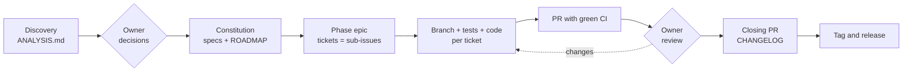

# sdd-kit

[](https://github.com/fabiodrneles/sdd-kit/actions/workflows/ci.yml)
[](LICENSE)
[Português](README.md)

**Spec Driven Development from the first commit to the release**, driven by [Claude Code](https://claude.com/claude-code) and delivered the way a professional team delivers: specs with acceptance criteria, one epic per phase, one ticket per task, one branch and one PR per ticket, green CI, review, CHANGELOG and tag.

> **The owner decides, the agent executes.** You answer the decisions and review the PRs; the agent analyzes, specifies, opens the tickets, writes code and tests and keeps CI green.


*Adoption in an empty repository and the first `make ci`, with real output ([how it was generated](docs/demo/demo.sh)).*

The kit comes from [cv-craft](https://github.com/fabiodrneles/cv-craft), which went from prototype to `v1.x` with this process ([case study](docs/case-study.en.md)), and sdd-kit itself is built with it ([specs](specs/README.md), [epic #1](https://github.com/fabiodrneles/sdd-kit/issues/1)). To see the process in a project built from scratch, with epic, tickets, PRs and a release, open [sdd-kit-demo](https://github.com/fabiodrneles/sdd-kit-demo). This repository's specs, issues and pull requests are written in Portuguese; code and commits are in English. The skill itself is in English and writes specs, issues and PRs in the owner's language, read from `CLAUDE.md`/`AGENTS.md` or asked once.

## What is in the kit

| Part | Purpose | Spec |
|---|---|---|
| `sdd-delivery` skill | Teaches the agent the whole process: evidence-based analysis, specs, epics, PRs, root-causing red CI, review, phase closing and release. Written in English, it writes specs, issues and PRs in the owner's language | [002](specs/002-skill-plugin/spec.md) |
| `template/` | `CLAUDE.md`, session hook, issue and PR templates, `CONTRIBUTING.md`, `CHANGELOG.md`, `specs/` skeleton and ready-made CI for **Go, Node/TS, Java, Python, Rust and C#/.NET** | [003](specs/003-template/spec.md) |
| Adoption script | Copies the template into a new or existing repository **without overwriting anything**; sh and PowerShell | [004](specs/004-adoption-script/spec.md) |

## How it works



| Step | Who | What lands in the repository |
|---|---|---|
| Discovery | Agent | `specs/ANALYSIS.md`: what was verified (command → result), findings by severity with evidence, open decisions D1..Dn with a recommendation |
| Decisions | **Owner** | Answers recorded in the specs; nothing is implemented before |
| Specs | Agent | `specs/constitution.md` (verifiable principles), one spec per area with `FR-*`, `NFR-*` and `AC-*` (Given/When/Then), `ROADMAP.md` by phases (the version comes from go-release-manager at closing) |
| Planning | Agent | One epic per phase and one ticket per task, as native GitHub sub-issues |
| Implementation | Agent | One branch and one PR per ticket; every `AC-*` becomes a test; `make ci` green before every push |
| Review and merge | **Owner** | Review in the epic's order; the agent answers and fixes |
| Closing | Agent → **Owner** | Closing PR (spec status, ROADMAP, CHANGELOG); the owner creates the tag and the workflow publishes the release |

**Work state lives on GitHub**, not in the chat: the epic keeps a "phase status" comment with PRs, CI, decisions and the next step. A new session reads that comment and resumes where the last one stopped.

## Starting a new repository

In about 5 minutes the kit is installed and the agent is working on your project.

**You need:** git, a GitHub repository and [Claude Code](https://claude.com/claude-code) installed. For CI to pass on your machine, also the project's language.

1. Create the repository on GitHub and clone it.
2. In the project folder, install the kit, replacing `go` with the project's language (`node`, `java`, `python`, `rust` or `dotnet`):

   ```text
   curl -fsSL https://raw.githubusercontent.com/fabiodrneles/sdd-kit/v1.11.0/scripts/adopt.sh | sh -s -- --lang go .
   ```

   The command copies into the repository:

   - the agent instructions (`CLAUDE.md` and `AGENTS.md`);
   - the `specs/` folder, where planning and decisions live, and `CHANGELOG.md`;
   - ready-made CI for the language (lint, tests with minimum coverage and build) and the `Makefile` with `make ci`;
   - issue and PR templates and the hook that prepares Claude Code sessions on the web.

   **It never overwrites a file you already have** and lists at the end what it created and what it skipped. To only see what it would do, without writing anything, add `--dry-run`:

   ```text
   curl -fsSL https://raw.githubusercontent.com/fabiodrneles/sdd-kit/v1.11.0/scripts/adopt.sh | sh -s -- --lang go --dry-run .
   ```

   In an empty repository, `--skeleton` also creates a minimal project with one test, so the first CI run is already green.

3. Commit what was created and open Claude Code in the project folder.
4. Ask: *"use the sdd-delivery skill: create the constitution, specs and ROADMAP for my idea: …"*. The agent proposes the open decisions and **stops** until you answer.
5. After answering: *"create the Phase 1 epic with its tickets and go ticket by ticket"*. Every task becomes a small PR with green CI for you to review.

## Adopting in an existing repository

Same script, built not to break anything:

- existing files (`README.md`, `CLAUDE.md`, CI…) are **never overwritten** without `--force`; the report lists what was created and what was skipped;
- `--dry-run` shows everything before writing;
- running it again changes nothing (idempotent).

```text
cd my-repo
sh /path/to/sdd-kit/scripts/adopt.sh --lang node --dry-run .
sh /path/to/sdd-kit/scripts/adopt.sh --lang node .
```

Then ask the agent for the **discovery phase**: *"use the sdd-delivery skill: analyze and verify this repository"*. It reads the code, runs what the README promises, records evidence-backed findings in `specs/ANALYSIS.md` and proposes decisions. From there the flow is the same as for a new repository.

### How the skill reaches each repository

The skill is **not copied** into repositories. It is published as a Claude Code plugin from this repository, and each project only declares that it uses it:

```json
{
  "extraKnownMarketplaces": {
    "sdd-kit": { "source": { "source": "github", "repo": "fabiodrneles/sdd-kit" } }
  },
  "enabledPlugins": { "sdd-delivery@sdd-kit": true }
}
```

Repositories adopted by the script get this configuration; if yours already had a `.claude/settings.json`, the script leaves it alone and you only add the two keys above. An improvement to the skill made here reaches every repository, with no diverging copies. What belongs to the project (specs, `CLAUDE.md`, CI) stays in the project.

## Where the gain is

| Common problem with agents | How the kit handles it |
|---|---|
| The agent "forgets" the project every session and rereads everything | `CLAUDE.md` with map and pitfalls + the epic's status comment: resuming reads one comment, not the whole repository |
| The session ends mid-task (usage limit, full context) and the work is lost | **Resume checkpoints:** after every step the agent records on the epic where it stopped (branch, commit, PRs, next step); the next session reads it on start and carries on, with nothing for you to explain |
| Tokens spent on reading and validation | The skill tells the agent to read excerpts, ask CI only for summaries and validate with one command (`make ci`) |
| Code that "looks done" but misses the request | Verifiable acceptance criteria; every `AC-*` becomes a test; each new test is mutation-checked |
| Huge PRs that are hard to review | One ticket = one branch = one PR, with a review order in the epic |
| Red CI "fixed" by disabling tests | Explicit rule: root cause, never skip a test or loosen a gate |
| Decisions made by the agent behind your back | Stop points: decisions, review, merge and tag belong to the owner |
| A long session that rereads the whole conversation on every call | **Short-session relay:** one fresh agent per ticket, starting with only the ticket's pack (see below) |

**Measured, not estimated** (`sdd-report.sh phase '#235' --compare '#225'`, 2026-10-06): the three Phase 13 tickets done by the relay cost on average **403 thousand tokens per ticket**, against **6.5 million** per ticket in Phase 12, done in one long session without the relay. That is **16 times less** per ticket and **5.4 times less** context reread per call (43 thousand against 231 thousand). Phase 13 tickets were smaller than Phase 12 ones, so the per-call gain is the fairest measure; each phase's report redoes the math with its own tickets.

## Why sdd-kit

The community already has great SDD tools, each strong at something:

| Tool | Best at | Focus |
|---|---|---|
| [spec-kit](https://github.com/github/spec-kit) (GitHub) | New projects and teams that want a standard flow | `constitution` → `specify` → `plan` → `tasks` → `implement`, for many agents |
| [OpenSpec](https://github.com/Fission-AI/OpenSpec) | Changes to existing code | Change proposals with deltas (`ADDED`/`MODIFIED`/`REMOVED`) archived into the specs |
| [Kiro](https://github.com/kirodotdev/Kiro) (AWS) | Integrated IDE experience | `requirements.md` in EARS notation, `design.md`, `tasks.md` and hooks |
| [BMAD Method](https://github.com/bmad-code-org/BMAD-METHOD) | Large and regulated projects | A simulated agile team with roles (analyst, PM, architect, QA…) |

**sdd-kit** covers the stretch those tools leave to you: **delivery**. The spec becomes an epic and tickets on GitHub, every ticket becomes a reviewable PR with green CI, the phase closes with a CHANGELOG and the release comes from a tag — with clear roles (the owner decides), **resume checkpoints** (close the session at any time; the next one continues on its own from where the last stopped) and ready-made CI per language. And the kit brings in their best ideas ([spec 006](specs/006-community-features/spec.md)): EARS criteria (Kiro), `ADDED`/`MODIFIED`/`REMOVED` deltas per spec (OpenSpec), AC → test traceability checks and slash commands (spec-kit), and `AGENTS.md` for other agents.

## Commands and checks

With the plugin installed, every step of the flow has a command: `/sdd-analyze` (discovery), `/sdd-specs` (constitution, specs, ROADMAP), `/sdd-epic <phase>` (epic and tickets), `/sdd-next` (next ticket to a green PR), `/sdd-status` (phase status comment, to resume in any session) and `/sdd-close <version>` (phase closing PR; the tag stays with the owner).

In adopted repositories:

- **`make ci`**: the same check as the language CI, with minimum coverage.
- **Release tag workflow**: *Actions → Release tag → Run workflow* creates the tag (computed from Conventional Commits by [go-release-manager](https://github.com/fabiodrneles/go-release-manager), or the ROADMAP one in `release-as`) and publishes the release with generated notes.
- **`make sdd-check`**: traceability. Every acceptance criterion of an `In Progress`/`Done` spec must be cited in a test as `NNN AC-n`, spec status must match the index and the ROADMAP may only cite existing IDs. CI and `make sdd-check` run it with `--strict`, so any warning blocks the merge.
- **`make linkcheck`** (broken links in `.md` files, with lychee) and **`scripts/doc-commands.sh`**, which runs in CI the README `bash` blocks marked with `<!-- doc-commands -->`.
- **Accessibility in the Node template:** with `A11Y_PAGES := dist/index.html`, `make ci` runs axe on those pages and fails on any violation.
- Acceptance criteria in Given/When/Then or **EARS**, a **"Mudanças"** (changes) section per spec feeding the CHANGELOG, and **`AGENTS.md`** for Codex, Copilot, Cursor and other agents.

### Token-saving scripts

Adoption also brings scripts for the mechanical steps of the process. The agent calls a script and reads one line per result instead of running dozens of steps and reading long outputs: `sdd-ci.sh` (wait for CI, show only the tail of failed logs), `sdd-wait.sh pr-merged|ci|issue-closed TARGET` (wait with no LLM for a PR merge, CI or an issue to close; one line at the end and an exit code: 0 held, 1 failed, 2 timed out; for background waiting, never a hand-written loop), `sdd-pr.sh` (ship the ticket branch: merge main, `make ci`, push, open or reuse the PR, wait for its CI, save the checkpoint), `sdd-release.sh [X.Y.Z]` (prepare the version's closing PR, with the version computed by go-release-manager; X.Y.Z only forces it: CHANGELOG draft from merged PRs, version bumps listed in `.sdd-release`, commit and PR; `--tag` after the merge dispatches the Release tag workflow or pushes the tag), `sdd-doctor.sh [--check]` (check and fix the local environment so `make ci` behaves like CI: pinned tool versions, Go `covdata`, a stale `golangci-lint` shadowing the right one on PATH, UTF-8 locale; one line per item, `--check` only reports), `sdd-mark.sh decide|close` (status files for decisions and phase closing), `sdd-phase-status.sh` (the epic's "Estado da fase" comment), `sdd-epic.sh` (phase epic and sub-issue tickets), `sdd-checkpoint.sh save|show` (resume checkpoint on the epic, so a new session picks up where the last one stopped), `sdd-resume.sh` (the whole resume routine in one command: checkpoint, branch, open PRs with CI, open epic issues) and, for Go, `sdd-release-check.sh pre|post` (simulate the release before tagging; verify the published release).

## Short-session relay

`scripts/sdd-relay.sh` works the open epic ticket by ticket, with no LLM in between. For each ticket it starts a fresh agent that begins with only the `scripts/sdd-context.sh` pack (the issue, the cited spec lines and the likely files), waits for the PR merge and moves to the next one. A short session rereads little context on each call; a long session rereads the whole conversation.

```sh
sh scripts/sdd-relay.sh --dry-run   # shows the next ticket and its pack, without calling the agent
sh scripts/sdd-relay.sh --max 1     # one ticket, then stop
sh scripts/sdd-relay.sh             # the whole epic, until the phase closes or a stop
```

- **Where:** on a machine or session with `claude` and `gh` authenticated, at the repository root. The default agent is `claude -p` with no permission prompts and only the delivery commands; `SDD_AGENT_CMD` swaps the agent.
- **Stops:** the relay stops and comments on the epic when the Next step is "ask the owner", when the PR's CI fails twice in a row and when the `SDD_BUDGET_TOKENS` budget runs out. `SDD_SESSION_MAX_TOKENS` (default 150000) caps each session's context. To interrupt, press Ctrl+C: run again, it resumes from GitHub.
- **Cost:** the relay records each ticket's exact cost on its issue, and `scripts/sdd-report.sh phase '#EPIC'` compares tickets with and without the relay.

## Event-driven engine

Every PR event (CI, merge, conflict) used to wake the agent's session and reload the whole conversation for a mechanical step. Adoption brings workflows that do those steps with no LLM; the agent opens the PR (`sdd-pr.sh --no-wait`), saves the checkpoint and ends the reply, and comes back only for judgment (code, root cause, a real conflict, review).

| Event | Workflow | What it does, with no LLM |
|---|---|---|
| Ticket PR merged | `sdd-on-merge.yml` | Updates the epic's checkpoint: done is the PR, next is the lowest open sub-issue |
| A PR's CI finishes | `sdd-ci-summary.yml` | Keeps a single comment with one line per check and the tail of failed logs; turns "green" when it passes |
| `main` changes | `sdd-update-prs.yml` | Merges `main` into open PRs behind it and warns once the ones with a real conflict |
| Last epic ticket closed | `sdd-on-phase-done.yml` | Opens the version's closing PR (`sdd-release.sh`) |
| Closing PR merged | `sdd-on-release-merge.yml` | Dispatches the version's release exactly once (`sdd-release.sh --tag`) |

All are idempotent, use only the `GITHUB_TOKEN` (or the optional secret below), no LLM secrets, and act only on PRs from the repository itself. `sdd-wait.sh` covers whatever is left to wait for in a shell. The sdd-kit itself runs this engine (`make self-sync` generates its workflows from the template and CI fails if they drift).

Repository setup:

1. **Required for the automatic closing PR and for `sdd-sync`:** *Settings → Actions → General → Workflow permissions* → enable **"Allow GitHub Actions to create and approve pull requests"**. Without it, `sdd-on-phase-done` cannot open the closing PR and `sdd-sync` fails with "GitHub Actions is not permitted to create or approve pull requests".
2. **Optional:** the `SDD_ENGINE_TOKEN` secret, a fine-grained token with write access to *Contents* and *Pull requests*. Pushes and PRs made with the `GITHUB_TOKEN` do not trigger CI. Without the secret, the engine dispatches CI itself (`workflow_dispatch`) on each PR branch it updates; with the secret, the push itself triggers it.
3. **Turn off:** the repository variable `SDD_ENGINE=off` disables every engine workflow (none reads or writes anything).
4. **CI name:** the summary listens to the workflow named `CI`. If the project renamed it, rename it back or adjust `workflows:` in `sdd-ci-summary.yml`.

## Automatic updates

Adoption writes `.sdd-kit.json` (kit version and a hash per managed file). Every Monday the `sdd-kit sync` workflow compares it with the latest release and opens **one PR**: untouched files are updated, files the kit did not change stay as they are, files both you and the kit changed get the new version and are listed under **"Conflitos"** for you to decide in the PR, files that are only yours are never touched, and `specs/` and `CHANGELOG.md` belong to the project: the kit creates them on adoption if missing and never changes them again. When the new version creates or changes files under `.github/workflows/`, the `GITHUB_TOKEN` cannot push them (it never gets the `workflows` permission). Without the **`SDD_SYNC_TOKEN`** secret (a fine-grained token with write access to *Contents*, *Pull requests* and *Workflows*; `SDD_ENGINE_TOKEN` works too if it has *Workflows*), the PR carries everything except those workflows and its description lists them: configure the secret, or run `sh scripts/sdd-sync.sh --only-workflows` on the PR branch and push. Enable *Settings → Actions → General → "Allow GitHub Actions to create and approve pull requests"*; without it the job pushes the `sdd-kit/sync` branch, writes the link to open the PR in the job summary and ends with a warning instead of failing. If you adopted up to `v1.3.0` and the sync fails with `Syntax error`, the old script was overwriting itself while running: run a copy of it once, from the repository root, and open the PR with the result (`cp scripts/sdd-sync.sh /tmp/sdd-sync.sh && sh /tmp/sdd-sync.sh`). From `v1.3.1` on, the script does this itself.

## Installing the skill

In Claude Code:

```text
/plugin marketplace add fabiodrneles/sdd-kit
/plugin install sdd-delivery@sdd-kit
```

### `sdd-release` plugin (optional)

Computes the next SemVer version from Conventional Commits with [go-release-manager](https://github.com/fabiodrneles/go-release-manager) and proposes closing the phase with it:

```text
/plugin install sdd-release@sdd-kit
/sdd-release
```

Tagging stays with the owner. To tag from GitHub, copy the [`release-tag.yml`](plugins/sdd-release/templates/release-tag.yml) template to `.github/workflows/` and run it from *Actions → Release tag → Run workflow*.

On claude.ai: download `sdd-delivery.zip` from the [latest release](https://github.com/fabiodrneles/sdd-kit/releases) and upload it under *Settings → Capabilities → Skills*.

## Adoption script

```text
sh scripts/adopt.sh --lang go|node|java|python|rust|dotnet [options] [TARGET]
pwsh -File scripts/adopt.ps1 --lang go|node|java|python|rust|dotnet [options] [TARGET]
```

Options: `--lang` (required), `--project` (default: directory name), `--owner`/`--repo` (default: taken from `origin`), `--dry-run`, `--force`, `--skeleton` (in an empty repository, creates a minimal project with one test so the first push already has green CI; never overwrites, not even with `--force`). In every language, `make ci` **fails when line coverage is below `COVERAGE_MIN`** (80 by default, set in the `Makefile`): c8 for Node, JaCoCo for Java, Maven or Gradle (no `pom.xml` or `build.gradle` change), `pytest-cov` for Python (in the `dev` extra), `go test -coverprofile` for Go `cargo llvm-cov` for Rust and coverlet (`coverlet.collector`, in the default `dotnet new` test templates) for C#/.NET. Every language template is tested in the kit's CI: the script adopts it into a minimal project, runs the generated `make ci` and checks that an untested file makes it fail on coverage.

## FAQ

**Do I need Claude Code?** The skill is written for it. The template (specs, CI, issue and PR templates) works for any team, with or without an agent.

**Does the agent merge on its own?** No. Merge, tag and release belong to the owner, unless explicitly delegated for one round.

**What if I already have `CLAUDE.md` or CI?** The script leaves them alone and lists them in the report; the discovery phase proposes how to integrate.

## Contributing

See [CONTRIBUTING.md](CONTRIBUTING.md) (English summary at the end), the [code of conduct](CODE_OF_CONDUCT.md) and the [security policy](SECURITY.md).

## License

[MIT](LICENSE)
