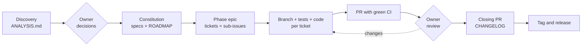

# sdd-kit

[](https://github.com/fabiodrneles/sdd-kit/actions/workflows/ci.yml)
[](LICENSE)
[Português](README.md)

**Spec Driven Development from the first commit to the release**, driven by [Claude Code](https://claude.com/claude-code) and delivered the way a professional team delivers: specs with acceptance criteria, one epic per phase, one ticket per task, one branch and one PR per ticket, green CI, review, CHANGELOG and tag.

> **The owner decides, the agent executes.** You answer the decisions and review the PRs; the agent analyzes, specifies, opens the tickets, writes code and tests and keeps CI green.

The kit comes from [cv-craft](https://github.com/fabiodrneles/cv-craft), which went from prototype to `v1.x` with this process ([case study](docs/case-study.en.md)), and sdd-kit itself is built with it ([specs](specs/README.md), [epic #1](https://github.com/fabiodrneles/sdd-kit/issues/1)). Specs, issues and pull requests are written in Portuguese; code and commits are in English.

## What is in the kit

| Part | Purpose | Spec |
|---|---|---|
| `sdd-delivery` skill | Teaches the agent the whole process: evidence-based analysis, specs, epics, PRs, root-causing red CI, review, phase closing and release | [002](specs/002-skill-plugin/spec.md) |
| `template/` | `CLAUDE.md`, session hook, issue and PR templates, `CONTRIBUTING.md`, `specs/` skeleton and ready-made CI for **Go, Node/TS, Java and Python** | [003](specs/003-template/spec.md) |
| Adoption script | Copies the template into a new or existing repository **without overwriting anything**; sh and PowerShell | [004](specs/004-adoption-script/spec.md) |

## How it works



| Step | Who | What lands in the repository |
|---|---|---|
| Discovery | Agent | `specs/ANALYSIS.md`: what was verified (command → result), findings by severity with evidence, open decisions D1..Dn with a recommendation |
| Decisions | **Owner** | Answers recorded in the specs; nothing is implemented before |
| Specs | Agent | `specs/constitution.md` (verifiable principles), one spec per area with `FR-*`, `NFR-*` and `AC-*` (Given/When/Then), `ROADMAP.md` by phases and versions |
| Planning | Agent | One epic per phase and one ticket per task, as native GitHub sub-issues |
| Implementation | Agent | One branch and one PR per ticket; every `AC-*` becomes a test; `make ci` green before every push |
| Review and merge | **Owner** | Review in the epic's order; the agent answers and fixes |
| Closing | Agent → **Owner** | Closing PR (spec status, ROADMAP, CHANGELOG); the owner creates the tag and the workflow publishes the release |

**Work state lives on GitHub**, not in the chat: the epic keeps a "phase status" comment with PRs, CI, decisions and the next step. A new session reads that comment and resumes where the last one stopped.

## Starting a new repository

1. Create the repository on GitHub and clone it.
2. Adopt the template with the project's language:

   ```text
   curl -fsSL https://raw.githubusercontent.com/fabiodrneles/sdd-kit/v0.1.0/scripts/adopt.sh | sh -s -- --lang go .
   ```

3. Commit what was created (`CLAUDE.md`, `.github/`, `specs/`, `Makefile`, CI) and open Claude Code in the repository.
4. Ask: *"use the sdd-delivery skill: create the constitution, specs and ROADMAP for my idea: …"*. The agent proposes the open decisions and **stops** until you answer.
5. After answering: *"create the Phase 1 epic with its tickets and go ticket by ticket"*.

## Adopting in an existing repository

Same script, built not to break anything:

- existing files (`README.md`, `CLAUDE.md`, CI…) are **never overwritten** without `--force`; the report lists what was created and what was skipped;
- `--dry-run` shows everything before writing;
- running it again changes nothing (idempotent).

```text
cd my-repo
sh /path/to/sdd-kit/scripts/adopt.sh --lang node --dry-run .
sh /path/to/sdd-kit/scripts/adopt.sh --lang node .
```

Then ask the agent for the **discovery phase**: *"use the sdd-delivery skill: analyze and verify this repository"*. It reads the code, runs what the README promises, records evidence-backed findings in `specs/ANALYSIS.md` and proposes decisions. From there the flow is the same as for a new repository.

### How the skill reaches each repository

The skill is **not copied** into repositories. It is published as a Claude Code plugin from this repository, and each project only declares that it uses it:

```json
{
  "extraKnownMarketplaces": {
    "sdd-kit": { "source": { "source": "github", "repo": "fabiodrneles/sdd-kit" } }
  },
  "enabledPlugins": { "sdd-delivery@sdd-kit": true }
}
```

Repositories adopted by the script get this configuration; if yours already had a `.claude/settings.json`, the script leaves it alone and you only add the two keys above. An improvement to the skill made here reaches every repository, with no diverging copies. What belongs to the project (specs, `CLAUDE.md`, CI) stays in the project.

## Where the gain is

| Common problem with agents | How the kit handles it |
|---|---|
| The agent "forgets" the project every session and rereads everything | `CLAUDE.md` with map and pitfalls + the epic's status comment: resuming reads one comment, not the whole repository |
| Tokens spent on reading and validation | The skill tells the agent to read excerpts, ask CI only for summaries and validate with one command (`make ci`) |
| Code that "looks done" but misses the request | Verifiable acceptance criteria; every `AC-*` becomes a test; each new test is mutation-checked |
| Huge PRs that are hard to review | One ticket = one branch = one PR, with a review order in the epic |
| Red CI "fixed" by disabling tests | Explicit rule: root cause, never skip a test or loosen a gate |
| Decisions made by the agent behind your back | Stop points: decisions, review, merge and tag belong to the owner |

## Why sdd-kit

The community already has great SDD tools, each strong at something:

| Tool | Best at | Focus |
|---|---|---|
| [spec-kit](https://github.com/github/spec-kit) (GitHub) | New projects and teams that want a standard flow | `constitution` → `specify` → `plan` → `tasks` → `implement`, for many agents |
| [OpenSpec](https://github.com/Fission-AI/OpenSpec) | Changes to existing code | Change proposals with deltas (`ADDED`/`MODIFIED`/`REMOVED`) archived into the specs |
| [Kiro](https://github.com/kirodotdev/Kiro) (AWS) | Integrated IDE experience | `requirements.md` in EARS notation, `design.md`, `tasks.md` and hooks |
| [BMAD Method](https://github.com/bmad-code-org/BMAD-METHOD) | Large and regulated projects | A simulated agile team with roles (analyst, PM, architect, QA…) |

**sdd-kit** covers the stretch those tools leave to you: **delivery**. The spec becomes an epic and tickets on GitHub, every ticket becomes a reviewable PR with green CI, the phase closes with a CHANGELOG and the release comes from a tag — with clear roles (the owner decides), cheap resumption across sessions and ready-made CI per language. And the kit brings in their best ideas ([spec 006](specs/006-community-features/spec.md)): EARS criteria (Kiro), `ADDED`/`MODIFIED`/`REMOVED` deltas per spec (OpenSpec), AC → test traceability checks and slash commands (spec-kit), and `AGENTS.md` for other agents.

## Commands and checks

With the plugin installed, every step of the flow has a command: `/sdd-analyze` (discovery), `/sdd-specs` (constitution, specs, ROADMAP), `/sdd-epic <phase>` (epic and tickets), `/sdd-next` (next ticket to a green PR), `/sdd-status` (phase status comment, to resume in any session) and `/sdd-close <version>` (phase closing PR; the tag stays with the owner).

In adopted repositories:

- **`make ci`**: the same check as the language CI.
- **`make sdd-check`**: traceability. Every acceptance criterion of an `In Progress`/`Done` spec must be cited in a test as `NNN AC-n`, spec status must match the index and the ROADMAP may only cite existing IDs. CI and `make sdd-check` run it with `--strict`, so any warning blocks the merge.
- Acceptance criteria in Given/When/Then or **EARS**, a **"Mudanças"** (changes) section per spec feeding the CHANGELOG, and **`AGENTS.md`** for Codex, Copilot, Cursor and other agents.

### Token-saving scripts

Adoption also brings scripts for the mechanical steps of the process. The agent calls a script and reads one line per result instead of running dozens of steps and reading long outputs: `sdd-ci.sh` (wait for CI, show only the tail of failed logs), `sdd-mark.sh decide|close` (status files for decisions and phase closing), `sdd-phase-status.sh` (the epic's "Estado da fase" comment), `sdd-epic.sh` (phase epic and sub-issue tickets) and, for Go, `sdd-release-check.sh pre|post` (simulate the release before tagging; verify the published release).

## Automatic updates

Adoption writes `.sdd-kit.json` (kit version and a hash per managed file). Every Monday the `sdd-kit sync` workflow compares it with the latest release and opens **one PR**: untouched files are updated, files the kit did not change stay as they are, files both you and the kit changed get the new version and are listed under **"Conflitos"** for you to decide in the PR, and files that are only yours are never touched. Enable *Settings → Actions → General → "Allow GitHub Actions to create and approve pull requests"*.

## Installing the skill

In Claude Code:

```text
/plugin marketplace add fabiodrneles/sdd-kit
/plugin install sdd-delivery@sdd-kit
```

### `sdd-release` plugin (optional)

Computes the next SemVer version from Conventional Commits with [go-release-manager](https://github.com/fabiodrneles/go-release-manager) and proposes closing the phase with it:

```text
/plugin install sdd-release@sdd-kit
/sdd-release
```

Tagging stays with the owner. To tag from GitHub, copy the [`release-tag.yml`](plugins/sdd-release/templates/release-tag.yml) template to `.github/workflows/` and run it from *Actions → Release tag → Run workflow*.

On claude.ai: download `sdd-delivery.zip` from the [latest release](https://github.com/fabiodrneles/sdd-kit/releases) and upload it under *Settings → Capabilities → Skills*.

## Adoption script

```text
sh scripts/adopt.sh --lang go|node|java|python [options] [TARGET]
pwsh -File scripts/adopt.ps1 --lang go|node|java|python [options] [TARGET]
```

Options: `--lang` (required), `--project` (default: directory name), `--owner`/`--repo` (default: taken from `origin`), `--dry-run`, `--force`. Every language template is tested in the kit's CI: the script adopts it into a minimal project and runs the generated `make ci`.

## FAQ

**Do I need Claude Code?** The skill is written for it. The template (specs, CI, issue and PR templates) works for any team, with or without an agent.

**Does the agent merge on its own?** No. Merge, tag and release belong to the owner, unless explicitly delegated for one round.

**What if I already have `CLAUDE.md` or CI?** The script leaves them alone and lists them in the report; the discovery phase proposes how to integrate.

## Contributing

See [CONTRIBUTING.md](CONTRIBUTING.md) (English summary at the end), the [code of conduct](CODE_OF_CONDUCT.md) and the [security policy](SECURITY.md).

## License

[MIT](LICENSE)
