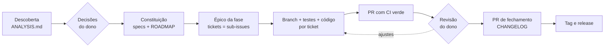

# sdd-kit

[](https://github.com/fabiodrneles/sdd-kit/actions/workflows/ci.yml)
[](LICENSE)
[English](README.en.md)

**Spec Driven Development do primeiro commit até a release**, conduzido pelo [Claude Code](https://claude.com/claude-code) e entregue do jeito que um time profissional entrega: specs com critérios de aceite, épico por fase, um ticket por tarefa, uma branch e um PR por ticket, CI verde, revisão, CHANGELOG e tag.

> **O dono decide, o agente executa.** Você responde às decisões e revisa os PRs; o agente analisa, especifica, abre os tickets, escreve código e testes e mantém o CI verde.

O kit nasceu do [cv-craft](https://github.com/fabiodrneles/cv-craft), que saiu de protótipo para `v1.x` com esse processo, e o próprio sdd-kit é desenvolvido com ele ([specs](specs/README.md), [épico #1](https://github.com/fabiodrneles/sdd-kit/issues/1)).

## Sumário

- [O que vem no kit](#o-que-vem-no-kit)
- [Como funciona](#como-funciona)
- [Começar num repositório novo](#começar-num-repositório-novo)
- [Adotar num repositório existente](#adotar-num-repositório-existente)
- [Onde está o ganho](#onde-está-o-ganho)
- [Por que o sdd-kit](#por-que-o-sdd-kit)
- [Instalar a skill](#instalar-a-skill)
- [Script de adoção](#script-de-adoção)
- [Perguntas frequentes](#perguntas-frequentes)
- [Contribuir](#contribuir)

## O que vem no kit

| Parte | Para quê | Spec |
|---|---|---|
| Skill `sdd-delivery` | Ensina o agente o processo inteiro: análise com evidências, specs, épicos, PRs, CI vermelho tratado pela causa raiz, revisão, fechamento de fase e release | [002](specs/002-skill-plugin/spec.md) |
| `template/` | `CLAUDE.md`, hook de sessão, templates de issue e PR, `CONTRIBUTING.md`, esqueleto de `specs/` e CI pronto para **Go, Node/TS, Java e Python** | [003](specs/003-template/spec.md) |
| Script de adoção | Copia o template para um repositório novo ou existente **sem sobrescrever nada**; sh e PowerShell | [004](specs/004-adoption-script/spec.md) |

## Como funciona



| Etapa | Quem | O que fica no repositório |
|---|---|---|
| Descoberta | Agente | `specs/ANALYSIS.md`: o que foi verificado (comando → resultado), achados por severidade com evidência, decisões em aberto D1..Dn com recomendação |
| Decisões | **Dono** | Respostas registradas nas specs; nada é implementado antes |
| Specs | Agente | `specs/constitution.md` (princípios verificáveis), uma spec por área com `FR-*`, `NFR-*` e `AC-*` (Dado/Quando/Então), `ROADMAP.md` por fases e versões |
| Planejamento | Agente | Um épico por fase e um ticket por tarefa, como sub-issues nativas do GitHub |
| Implementação | Agente | Uma branch e um PR por ticket; cada `AC-*` vira teste; `make ci` verde antes de todo push |
| Revisão e merge | **Dono** | Revisão na ordem do épico; o agente responde e corrige |
| Fechamento | Agente → **Dono** | PR de fechamento (status das specs, ROADMAP, CHANGELOG); o dono cria a tag e o workflow publica a release |

O **estado do trabalho vive no GitHub**, não na conversa: o épico guarda um comentário "Estado da fase" com PRs, CI, decisões e próximo passo. Uma sessão nova lê esse comentário e continua de onde parou.

## Começar num repositório novo

1. Crie o repositório no GitHub e clone.
2. Adote o template com a linguagem do projeto:

   ```text
   curl -fsSL https://raw.githubusercontent.com/fabiodrneles/sdd-kit/v0.1.0/scripts/adopt.sh | sh -s -- --lang go .
   ```

3. Faça o commit do que foi criado (`CLAUDE.md`, `.github/`, `specs/`, `Makefile`, CI) e abra o Claude Code no repositório. O `.claude/settings.json` gerado já carrega o hook de sessão.
4. Peça: *"use a skill sdd-delivery: crie a constituição, as specs e o ROADMAP para a minha ideia: …"*. O agente propõe as decisões em aberto e **para** até você responder.
5. Depois das respostas: *"crie o épico da Fase 1 com os tickets e siga ticket a ticket"*.

## Adotar num repositório existente

O caminho é o mesmo script, e ele foi feito para não estragar nada:

- arquivos que já existem (`README.md`, `CLAUDE.md`, CI…) **nunca são sobrescritos** sem `--force`; o relatório lista o que foi criado e o que foi ignorado;
- `--dry-run` mostra tudo antes de escrever;
- rodar de novo não muda nada (idempotente).

```text
cd meu-repo
sh /caminho/do/sdd-kit/scripts/adopt.sh --lang node --dry-run .
sh /caminho/do/sdd-kit/scripts/adopt.sh --lang node .
```

Depois peça ao agente a **fase de descoberta**: *"use a skill sdd-delivery: analise e verifique este repositório"*. Ele lê o código, roda o que o README promete, registra os achados com evidência em `specs/ANALYSIS.md` e propõe as decisões. A partir daí o fluxo é o mesmo de um repositório novo.

### Como a skill chega a cada repositório

A skill **não é copiada** para os repositórios. Ela é publicada como plugin do Claude Code neste repositório, e cada projeto só declara que usa o plugin:

```json
{
  "extraKnownMarketplaces": {
    "sdd-kit": { "source": { "source": "github", "repo": "fabiodrneles/sdd-kit" } }
  },
  "enabledPlugins": { "sdd-delivery@sdd-kit": true }
}
```

Repositórios adotados pelo script já recebem essa configuração; se o seu já tinha um `.claude/settings.json`, o script não o altera e basta acrescentar as duas chaves acima. Uma melhoria na skill feita aqui chega a todos os repositórios, sem cópias divergentes. O que é do projeto (specs, `CLAUDE.md`, CI) continua no projeto. O [cv-craft](https://github.com/fabiodrneles/cv-craft) já funciona assim.

## Onde está o ganho

| Problema comum com agentes | Como o kit resolve |
|---|---|
| O agente "esquece" o projeto a cada sessão e relê tudo | `CLAUDE.md` com mapa e armadilhas + comentário "Estado da fase" no épico: a retomada lê um comentário, não o repositório inteiro |
| Gasto de tokens com leitura e validação | A skill orienta a ler trechos, pedir só o resumo do CI e validar tudo num comando (`make ci`) |
| Código que "parece pronto" mas não cumpre o pedido | Critérios de aceite verificáveis; cada `AC-*` vira teste; mutação de cada teste novo |
| PRs gigantes e difíceis de revisar | Um ticket = uma branch = um PR, com ordem de revisão no épico |
| CI vermelho "resolvido" desligando teste | Regra explícita: causa raiz, nunca pular teste ou afrouxar gate |
| Decisões tomadas pelo agente sem você saber | Pontos de parada: decisões, revisão, merge e tag são do dono |
| Ferramentas instaladas no meio do trabalho | Hook de sessão instala as ferramentas do CI na versão certa |

## Por que o sdd-kit

A comunidade já tem ótimas ferramentas de SDD, e cada uma brilha num ponto:

| Ferramenta | Melhor em | Foco |
|---|---|---|
| [spec-kit](https://github.com/github/spec-kit) (GitHub) | Projetos novos e times que querem um fluxo padrão | `constitution` → `specify` → `plan` → `tasks` → `implement`, para vários agentes |
| [OpenSpec](https://github.com/Fission-AI/OpenSpec) | Mudanças em código existente | Propostas de mudança com deltas (`ADDED`/`MODIFIED`/`REMOVED`) arquivadas nas specs |
| [Kiro](https://github.com/kirodotdev/Kiro) (AWS) | Experiência integrada na IDE | `requirements.md` em notação EARS, `design.md`, `tasks.md` e hooks |
| [BMAD Method](https://github.com/bmad-code-org/BMAD-METHOD) | Projetos grandes e regulados | Time ágil simulado com papéis (analista, PM, arquiteto, QA…) |

O **sdd-kit** cobre o trecho que essas ferramentas deixam para você: **a entrega**. A spec vira épico e tickets no GitHub, cada ticket vira um PR revisável com CI verde, a fase fecha com CHANGELOG e a release sai de uma tag. Tudo com papéis claros (o dono decide), retomada barata entre sessões e CI pronto por linguagem. As ideias delas que fazem sentido aqui estão em avaliação na spec 006 (critérios em EARS, deltas para código existente, checagem de rastreabilidade AC → teste, comandos de barra).

## Instalar a skill

No Claude Code:

```text
/plugin marketplace add fabiodrneles/sdd-kit
/plugin install sdd-delivery@sdd-kit
```

No claude.ai: baixe `sdd-delivery.zip` da [última release](https://github.com/fabiodrneles/sdd-kit/releases) e envie em *Configurações → Capacidades → Skills*.

## Script de adoção

```text
sh scripts/adopt.sh --lang go|node|java|python [opções] [DESTINO]
pwsh -File scripts/adopt.ps1 --lang go|node|java|python [opções] [DESTINO]
```

| Opção | Efeito |
|---|---|
| `--lang` | `go`, `node`, `java` ou `python` (obrigatório) |
| `--project` | Nome do projeto (padrão: nome do diretório) |
| `--owner`, `--repo` | Dono e repositório no GitHub (padrão: deduzidos do `origin`) |
| `--dry-run` | Mostra o que seria feito, sem escrever |
| `--force` | Sobrescreve arquivos existentes |

O que cada linguagem recebe:

| Linguagem | `make ci` roda | CI |
|---|---|---|
| Go | golangci-lint, `go test -race -cover`, `go build` | `setup-go` pelo `go.mod` |
| Node/TS | `lint` e `build` (se existirem), `test` | Node LTS, `npm ci` |
| Java | `mvn verify` (ou `./mvnw`) | Temurin 21, cache Maven |
| Python | `ruff check`, `ruff format --check`, `pytest` | Python 3.12, extra `dev` |

Todo template é testado no CI do kit: o script adota cada linguagem num projeto mínimo e roda o `make ci` gerado.

## Perguntas frequentes

**Preciso usar o Claude Code?** A skill foi escrita para ele. O template (specs, CI, templates de issue e PR) serve para qualquer time, com ou sem agente.

**Funciona com monorepo ou outra linguagem?** Use `--lang` com a linguagem principal e ajuste o `Makefile`; novas linguagens entram como tickets próprios ([ROADMAP](specs/ROADMAP.md)).

**O agente faz merge sozinho?** Não. Merge, tag e release são do dono, salvo delegação explícita para uma rodada.

**E se eu já tenho `CLAUDE.md` ou CI?** O script não toca neles e lista no relatório; a fase de descoberta propõe como integrar.

## Contribuir

O kit é desenvolvido com o próprio processo: [constituição](specs/constitution.md), [specs](specs/README.md), [CLAUDE.md](CLAUDE.md). Antes de todo push:

```text
make ci
```

## Licença

[MIT](LICENSE)
