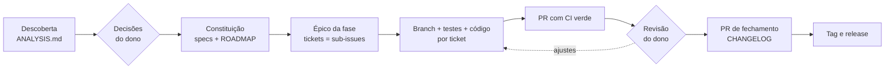

# sdd-kit

[](https://github.com/fabiodrneles/sdd-kit/actions/workflows/ci.yml)
[](LICENSE)
[English](README.en.md)

**Spec Driven Development do primeiro commit até a release**, conduzido pelo [Claude Code](https://claude.com/claude-code) e entregue do jeito que um time profissional entrega: specs com critérios de aceite, épico por fase, um ticket por tarefa, uma branch e um PR por ticket, CI verde, revisão, CHANGELOG e tag.

> **O dono decide, o agente executa.** Você responde às decisões e revisa os PRs; o agente analisa, especifica, abre os tickets, escreve código e testes e mantém o CI verde.


*A adoção num repositório vazio e o primeiro `make ci`, com a saída real ([como foi gerado](docs/demo/demo.sh)).*

O kit nasceu do [cv-craft](https://github.com/fabiodrneles/cv-craft), que saiu de protótipo para `v1.x` com esse processo ([estudo de caso](docs/case-study.md)), e o próprio sdd-kit é desenvolvido com ele ([specs](specs/README.md), [épico #1](https://github.com/fabiodrneles/sdd-kit/issues/1)). Para ver o processo num projeto criado do zero, com épico, tickets, PRs e release, abra o [sdd-kit-demo](https://github.com/fabiodrneles/sdd-kit-demo).

## Sumário

- [O que vem no kit](#o-que-vem-no-kit)
- [Como funciona](#como-funciona)
- [Começar num repositório novo](#começar-num-repositório-novo)
- [Adotar num repositório existente](#adotar-num-repositório-existente)
- [Onde está o ganho](#onde-está-o-ganho)
- [Por que o sdd-kit](#por-que-o-sdd-kit)
- [Comandos e verificações](#comandos-e-verificações)
- [Motor orientado a eventos](#motor-orientado-a-eventos)
- [Atualização automática](#atualização-automática)
- [axyn](#axyn)
- [Passo a passo para iniciantes](#passo-a-passo-para-iniciantes)
- [Problemas comuns e como resolver](#problemas-comuns-e-como-resolver)
- [Como o axyn funciona por dentro](#como-o-axyn-funciona-por-dentro)
- [Atualizar o axyn](#atualizar-o-axyn-quando-sair-uma-versão-nova)
- [Instalar a skill](#instalar-a-skill)
- [Script de adoção](#script-de-adoção)
- [Perguntas frequentes](#perguntas-frequentes)
- [Contribuir](#contribuir)

## O que vem no kit

| Parte | Para quê | Spec |
|---|---|---|
| Skill `sdd-delivery` | Ensina o agente o processo inteiro: análise com evidências, specs, épicos, PRs, CI vermelho tratado pela causa raiz, revisão, fechamento de fase e release. Escrita em inglês, escreve specs, issues e PRs no idioma do dono | [002](specs/002-skill-plugin/spec.md) |
| `template/` | `CLAUDE.md`, hook de sessão, templates de issue e PR, `CONTRIBUTING.md`, `CHANGELOG.md`, esqueleto de `specs/` e CI pronto para **Go, Node/TS, Java, Python, Rust e C#/.NET** | [003](specs/003-template/spec.md) |
| Script de adoção | Copia o template para um repositório novo ou existente **sem sobrescrever nada**; sh e PowerShell | [004](specs/004-adoption-script/spec.md) |

## Como funciona



| Etapa | Quem | O que fica no repositório |
|---|---|---|
| Descoberta | Agente | `specs/ANALYSIS.md`: o que foi verificado (comando → resultado), achados por severidade com evidência, decisões em aberto D1..Dn com recomendação |
| Decisões | **Dono** | Respostas registradas nas specs; nada é implementado antes |
| Specs | Agente | `specs/constitution.md` (princípios verificáveis), uma spec por área com `FR-*`, `NFR-*` e `AC-*` (Dado/Quando/Então), `ROADMAP.md` por fases (a versão vem do go-release-manager no fechamento) |
| Planejamento | Agente | Um épico por fase e um ticket por tarefa, como sub-issues nativas do GitHub |
| Implementação | Agente | Uma branch e um PR por ticket; cada `AC-*` vira teste; `make ci` verde antes de todo push |
| Revisão e merge | **Dono** | Revisão na ordem do épico; o agente responde e corrige |
| Fechamento | Agente → **Dono** | PR de fechamento (status das specs, ROADMAP, CHANGELOG); o dono cria a tag e o workflow publica a release |

O **estado do trabalho vive no GitHub**, não na conversa: o épico guarda um comentário "Estado da fase" com PRs, CI, decisões e próximo passo. Uma sessão nova lê esse comentário e continua de onde parou.

## Começar num repositório novo

Em uns 5 minutos o kit está instalado e o agente trabalhando no seu projeto.

**Você precisa de:** git, um repositório no GitHub e o [Claude Code](https://claude.com/claude-code) instalado. Para o CI passar na sua máquina, também a linguagem do projeto.

1. Crie o repositório no GitHub e clone.
2. Na pasta do projeto, instale o kit, trocando `go` pela linguagem do projeto (`node`, `java`, `python`, `rust` ou `dotnet`):

   ```text
   curl -fsSL https://raw.githubusercontent.com/fabiodrneles/sdd-kit/v1.23.7/scripts/adopt.sh | sh -s -- --lang go .
   ```

   O comando copia para o repositório:

   - as instruções para o agente (`CLAUDE.md` e `AGENTS.md`);
   - a pasta `specs/`, onde ficam o planejamento e as decisões, e o `CHANGELOG.md`;
   - o CI pronto para a linguagem (lint, testes com cobertura mínima e build) e o `Makefile` com o `make ci`;
   - os modelos de issue e de PR e o hook que prepara as sessões do Claude Code na web.

   **Ele nunca sobrescreve um arquivo que você já tem** e mostra no final o que criou e o que deixou de lado. Para só ver o que ele faria, sem gravar nada, acrescente `--dry-run`:

   ```text
   curl -fsSL https://raw.githubusercontent.com/fabiodrneles/sdd-kit/v1.23.7/scripts/adopt.sh | sh -s -- --lang go --dry-run .
   ```

   Num repositório vazio, `--skeleton` cria também um projeto mínimo com um teste, para o primeiro CI já nascer verde.

3. Faça o commit do que foi criado e abra o Claude Code na pasta do projeto.
4. Peça: *"use a skill sdd-delivery: crie a constituição, as specs e o ROADMAP para a minha ideia: …"*. O agente propõe as decisões em aberto e **para** até você responder.
5. Depois das respostas: *"crie o épico da Fase 1 com os tickets e siga ticket a ticket"*. Cada tarefa vira um PR pequeno, com CI verde, para você revisar.

## Adotar num repositório existente

O caminho é o mesmo script, e ele foi feito para não estragar nada:

- arquivos que já existem (`README.md`, `CLAUDE.md`, CI…) **nunca são sobrescritos** sem `--force`; o relatório lista o que foi criado e o que foi ignorado;
- `--dry-run` mostra tudo antes de escrever;
- rodar de novo não muda nada (idempotente).

```text
cd meu-repo
sh /caminho/do/sdd-kit/scripts/adopt.sh --lang node --dry-run .
sh /caminho/do/sdd-kit/scripts/adopt.sh --lang node .
```

Depois peça ao agente a **fase de descoberta**: *"use a skill sdd-delivery: analise e verifique este repositório"*. Ele lê o código, roda o que o README promete, registra os achados com evidência em `specs/ANALYSIS.md` e propõe as decisões. A partir daí o fluxo é o mesmo de um repositório novo.

### Como a skill chega a cada repositório

A skill **não é copiada** para os repositórios. Ela é publicada como plugin do Claude Code neste repositório, e cada projeto só declara que usa o plugin:

```json
{
  "extraKnownMarketplaces": {
    "sdd-kit": { "source": { "source": "github", "repo": "fabiodrneles/sdd-kit" } }
  },
  "enabledPlugins": { "sdd-delivery@sdd-kit": true }
}
```

Repositórios adotados pelo script já recebem essa configuração; se o seu já tinha um `.claude/settings.json`, o script não o altera e basta acrescentar as duas chaves acima. Uma melhoria na skill feita aqui chega a todos os repositórios, sem cópias divergentes. O que é do projeto (specs, `CLAUDE.md`, CI) continua no projeto. O [cv-craft](https://github.com/fabiodrneles/cv-craft) já funciona assim.

## Onde está o ganho

| Problema comum com agentes | Como o kit resolve |
|---|---|
| O agente "esquece" o projeto a cada sessão e relê tudo | `CLAUDE.md` com mapa e armadilhas + comentário "Estado da fase" no épico: a retomada lê um comentário, não o repositório inteiro |
| A sessão acaba no meio (limite de uso, contexto cheio) e o trabalho se perde | **Checkpoints de retomada:** a cada passo, o agente grava no épico onde parou (branch, commit, PRs, próximo passo); a sessão seguinte o lê sozinha ao abrir e continua, sem você explicar nada |
| Gasto de tokens com leitura e validação | A skill orienta a ler trechos, pedir só o resumo do CI e validar tudo num comando (`make ci`) |
| Código que "parece pronto" mas não cumpre o pedido | Critérios de aceite verificáveis; cada `AC-*` vira teste; mutação de cada teste novo |
| PRs gigantes e difíceis de revisar | Um ticket = uma branch = um PR, com ordem de revisão no épico |
| CI vermelho "resolvido" desligando teste | Regra explícita: causa raiz, nunca pular teste ou afrouxar gate |
| Decisões tomadas pelo agente sem você saber | Pontos de parada: decisões, revisão, merge e tag são do dono |
| Ferramentas instaladas no meio do trabalho | Hook de sessão instala as ferramentas do CI na versão certa |
| Sessão longa que relê a conversa inteira a cada chamada | **Relé de sessões curtas:** um agente novo por ticket, que começa só com o pacote do ticket (veja abaixo) |

## Por que o sdd-kit

A comunidade já tem ótimas ferramentas de SDD, e cada uma brilha num ponto:

| Ferramenta | Melhor em | Foco |
|---|---|---|
| [spec-kit](https://github.com/github/spec-kit) (GitHub) | Projetos novos e times que querem um fluxo padrão | `constitution` → `specify` → `plan` → `tasks` → `implement`, para vários agentes |
| [OpenSpec](https://github.com/Fission-AI/OpenSpec) | Mudanças em código existente | Propostas de mudança com deltas (`ADDED`/`MODIFIED`/`REMOVED`) arquivadas nas specs |
| [Kiro](https://github.com/kirodotdev/Kiro) (AWS) | Experiência integrada na IDE | `requirements.md` em notação EARS, `design.md`, `tasks.md` e hooks |
| [BMAD Method](https://github.com/bmad-code-org/BMAD-METHOD) | Projetos grandes e regulados | Time ágil simulado com papéis (analista, PM, arquiteto, QA…) |

O **sdd-kit** cobre o trecho que essas ferramentas deixam para você: **a entrega**. A spec vira épico e tickets no GitHub, cada ticket vira um PR revisável com CI verde, a fase fecha com CHANGELOG e a release sai de uma tag. Tudo com papéis claros (o dono decide), **checkpoints de retomada** (feche a sessão a qualquer momento; a próxima continua sozinha de onde a anterior parou) e CI pronto por linguagem. E o kit incorpora o melhor delas ([spec 006](specs/006-community-features/spec.md)): critérios em EARS (Kiro), deltas `ADDED`/`MODIFIED`/`REMOVED` por spec (OpenSpec), checagem de rastreabilidade AC → teste e comandos de barra (spec-kit), e `AGENTS.md` para outros agentes.

## Comandos e verificações

Com o plugin instalado, cada etapa do fluxo tem um comando:

| Comando | Faz |
|---|---|
| `/sdd-analyze` | Descoberta: `specs/ANALYSIS.md` com evidências e decisões; para e espera o dono |
| `/sdd-specs` | Constituição, specs e ROADMAP a partir das decisões |
| `/sdd-epic <fase>` | Épico da fase com os tickets como sub-issues |
| `/sdd-next` | Próximo ticket do épico até um PR com CI verde |
| `/sdd-status` | Comentário "Estado da fase" no épico (para retomar em qualquer sessão) |
| `/sdd-close <versão>` | PR de fechamento (status das specs, ROADMAP, CHANGELOG); a tag fica com o dono |

Nos repositórios adotados:

- **`make ci`**: a mesma verificação do CI da linguagem, com cobertura mínima.
- **Workflow Release tag**: *Actions → Release tag → Run workflow* cria a tag (calculada pelos Conventional Commits com o [go-release-manager](https://github.com/fabiodrneles/go-release-manager), ou a do ROADMAP em `release-as`) e publica a release com as notas geradas.
- **`make sdd-check`**: rastreabilidade. Todo critério de aceite de spec `In Progress`/`Done` precisa ser citado num teste como `NNN AC-n` (ex.: `// 003 AC-2`), o status das specs bate com o índice e o ROADMAP só cita IDs que existem. No CI e no `make sdd-check`, roda com `--strict`: um aviso bloqueia o merge.
- **Critérios de aceite** em Dado/Quando/Então ou em **EARS** (`QUANDO <gatilho>, O SISTEMA DEVE <resposta>`).
- **Seção "Mudanças"** em cada spec (`ADDED`/`MODIFIED`/`REMOVED` + ID), que vira o CHANGELOG no fechamento da fase.
- **`make linkcheck`** (links quebrados nos `.md`, com o lychee) e **`scripts/doc-commands.sh`**, que roda no CI os blocos `bash` do README marcados com `<!-- doc-commands -->`.
- **Acessibilidade no template Node:** com `A11Y_PAGES := dist/index.html`, o `make ci` roda o axe nas páginas e falha em qualquer violação.
- **`AGENTS.md`**, para Codex, Copilot, Cursor e outros agentes seguirem o mesmo processo.

### Scripts que poupam tokens

A adoção também traz scripts para os passos mecânicos do processo. O agente chama o script e lê uma linha por resultado, em vez de executar dezenas de passos e ler saídas longas:

| Script | Faz |
|---|---|
| `scripts/sdd-ci.sh [#PR\|SHA]` | Espera o CI e mostra só o fim do log dos checks que falharam |
| `scripts/sdd-wait.sh pr-merged\|ci\|issue-closed ALVO` | Espera, sem LLM, um PR ser mergeado, o CI terminar ou uma issue fechar; uma linha no fim e código de saída (0 valeu, 1 falhou, 2 tempo esgotado). Para esperar em segundo plano, nunca um laço à mão |
| `scripts/sdd-pr.sh [--spec NNN] [--dry-run]` | Entrega a branch do ticket: merge da `main`, `make ci`, push, PR (ou reaproveita o aberto), CI do PR e checkpoint |
| `scripts/sdd-doctor.sh [--check]` | Confere e conserta o ambiente local para o `make ci` valer como o CI (ferramentas nas versões do Makefile, `covdata`, `golangci-lint` ofuscado no PATH, locale UTF-8); uma linha por item, `--check` só relata |
| `scripts/sdd-release.sh [X.Y.Z] [--dry-run]` | PR de fechamento da versão (versão calculada pelo go-release-manager; X.Y.Z só força): rascunho do CHANGELOG pelos PRs mesclados, versões do `.sdd-release`, commit e PR; `--tag` depois do merge dispara o *Release tag* ou cria a tag |
| `scripts/sdd-mark.sh decide D1=a` | Registra as decisões do dono e aprova as specs |
| `scripts/sdd-mark.sh close vX.Y.Z` | Arquivos de status do fechamento da fase (specs, ROADMAP, CHANGELOG) |
| `scripts/sdd-phase-status.sh [--post]` | Comentário "Estado da fase" do épico |
| `scripts/sdd-epic.sh [--dry-run] N` | Épico da fase N e os tickets como sub-issues |
| `scripts/sdd-checkpoint.sh save\|show` | Checkpoint de retomada no épico: uma sessão nova continua sozinha de onde a anterior parou |
| `scripts/sdd-resume.sh` | Retomada em um comando: checkpoint, branch, PRs abertos com CI e issues abertas do épico |
| `scripts/sdd-release-check.sh pre\|post vX.Y.Z` | Go: simula o release antes da tag e confere a release publicada |

## Relé de sessões curtas

O `scripts/sdd-relay.sh` trabalha o épico aberto ticket a ticket, sem LLM no meio. Para cada ticket, abre um agente novo que começa só com o pacote do `scripts/sdd-context.sh` (a issue, as linhas citadas da spec e os arquivos prováveis), espera o merge do PR e segue para o próximo. Uma sessão curta relê pouco contexto a cada chamada; uma sessão longa relê a conversa inteira.

```sh
sh scripts/sdd-relay.sh --dry-run   # mostra o próximo ticket e o pacote, sem chamar o agente
sh scripts/sdd-relay.sh --max 1     # um ticket e para
sh scripts/sdd-relay.sh             # o épico inteiro, até a fase fechar ou uma parada
```

- **Onde:** numa máquina ou sessão com o `claude` e o `gh` autenticados, na raiz do repositório. O agente padrão é `claude -p` sem prompts de permissão, só com os comandos da entrega; `SDD_AGENT_CMD` troca o agente.
- **Paradas:** o relé para e comenta no épico quando o Próximo é "perguntar ao dono", quando o CI do PR falha duas vezes seguidas e quando o orçamento `SDD_BUDGET_TOKENS` acaba. `SDD_SESSION_MAX_TOKENS` (padrão 150000) é o teto de contexto de cada sessão. Para interromper, use Ctrl+C: rodado de novo, ele retoma do GitHub.
- **Custo:** o relé grava em cada issue o custo exato do ticket, e o `scripts/sdd-report.sh phase '#ÉPICO'` compara os tickets com e sem relé.

## Motor orientado a eventos

Cada evento de PR que acordava a sessão do agente (CI, merge, conflito) recarregava a conversa inteira só para fazer um passo mecânico. A adoção traz workflows que fazem esses passos sem LLM; o agente abre o PR (`sdd-pr.sh --no-wait`), grava o checkpoint e encerra a resposta, e volta só quando há julgamento (código, causa raiz, conflito real, revisão).

| Evento | Workflow | O que faz, sem LLM |
|---|---|---|
| PR de ticket mergeado | `sdd-on-merge.yml` | Atualiza o checkpoint do épico: feito é o PR, próximo é o menor sub-issue aberto |
| CI de um PR termina | `sdd-ci-summary.yml` | Mantém um único comentário com uma linha por check e o fim do log das falhas; vira "verde" quando passa |
| `main` muda | `sdd-update-prs.yml` | Traz a `main` (merge) para os PRs abertos atrás dela e avisa uma vez os que têm conflito real |
| Último ticket do épico fechado | `sdd-on-phase-done.yml` | Abre o PR de fechamento da versão (`sdd-release.sh`) |
| PR de fechamento mergeado | `sdd-on-release-merge.yml` | Dispara a release da versão uma única vez (`sdd-release.sh --tag`) |

Todos são idempotentes, usam só o `GITHUB_TOKEN` (ou o segredo opcional abaixo), sem segredos de LLM, e só agem em PRs do próprio repositório. O `sdd-wait.sh` cobre o que sobrar para esperar num shell. O próprio sdd-kit roda esse motor (`make self-sync` gera os workflows dele a partir do template e o CI falha se divergirem).

Configuração do repositório:

1. **Obrigatório para o fechamento automático e para o `sdd-sync`:** *Settings → Actions → General → Workflow permissions* → marque **"Allow GitHub Actions to create and approve pull requests"**. Sem isso, o `sdd-on-phase-done` não abre o PR de fechamento e o `sdd-sync` falha com "GitHub Actions is not permitted to create or approve pull requests".
2. **Opcional:** o segredo `SDD_ENGINE_TOKEN`, um token fine-grained com permissão de escrita em *Contents* e *Pull requests*. Pushes e PRs feitos com o `GITHUB_TOKEN` não disparam o CI. Sem o segredo, o motor dispara ele mesmo o CI (`workflow_dispatch`) na branch de cada PR que atualizar; com o segredo, o próprio push já dispara.
3. **Desligar:** a variável de repositório `SDD_ENGINE=off` desliga todos os workflows do motor (nenhum lê nem escreve nada).
4. **Nome do CI:** o resumo escuta o workflow chamado `CI`. Se o projeto o renomeou, volte o nome ou ajuste `workflows:` em `sdd-ci-summary.yml`.

**Merge automático:** `sh scripts/sdd-auto-merge.sh on` liga, `off` desliga (padrão) e `status` mostra; ou peça ao agente. Ligado, todo PR com o CI verde e sem conflito é mesclado sozinho, inclusive os do relé, e o motor segue com o checkpoint, a fase e a release.

## Atualização automática

A adoção grava `.sdd-kit.json` (versão do kit e o hash de cada arquivo gerenciado). Toda segunda-feira, o workflow `sdd-kit sync` compara com a última release e abre **um PR** com as atualizações:

- arquivos que você não alterou são atualizados;
- arquivos que o kit não mudou ficam como estão, mesmo se você os alterou;
- se você e o kit mudaram o mesmo arquivo, o PR traz a versão nova e lista o arquivo em **"Conflitos"**, para você decidir no próprio PR;
- arquivos que são só do seu repositório nunca são tocados;
- `specs/` e `CHANGELOG.md` são do projeto: o kit os cria na adoção, se faltarem, e nunca mais os altera.

Quando a versão nova cria ou muda arquivos em `.github/workflows/`, o `GITHUB_TOKEN` não consegue enviá-los (ele nunca recebe a permissão `workflows`). Sem o segredo **`SDD_SYNC_TOKEN`**, o PR traz tudo menos esses workflows, e a descrição os lista com o que fazer: configurar o segredo (token fine-grained com *Contents*, *Pull requests* e *Workflows* em escrita; o `SDD_ENGINE_TOKEN`, se tiver a permissão *Workflows*, também serve) ou rodar `sh scripts/sdd-sync.sh --only-workflows` na branch do PR e enviar o resultado.

Para o workflow abrir PRs, ative em *Settings → Actions → General* a opção **"Allow GitHub Actions to create and approve pull requests"**. Sem ela, o job envia a branch `sdd-kit/sync`, grava no resumo o link para abrir o PR e termina com um aviso, não com falha.

Quem adotou até a `v1.3.0` e vê a sincronização falhar com `Syntax error`: o script antigo se sobrescrevia enquanto rodava. Rode uma vez uma cópia dele, na raiz do repositório, e abra o PR com o resultado: `cp scripts/sdd-sync.sh /tmp/sdd-sync.sh && sh /tmp/sdd-sync.sh`. Da `v1.3.1` em diante, o próprio script faz isso.

## axyn

O **axyn** leva o processo para o [opencode](https://opencode.ai) com modelos gratuitos ou locais: você descreve o que quer, ele escreve a spec, abre os tickets e entrega **um PR por ticket**, só avançando quando os portões passam (o `make ci` do projeto, teste afrouxado ou apagado, arquivos protegidos e tamanho do diff). É um binário único, sem dependências.

Nunca usou um terminal? Siga o [passo a passo para iniciantes](#passo-a-passo-para-iniciantes).

**1. Instalar, num comando.** Dentro do repositório clonado do projeto (o binário vai para `~/.local/bin`; sem o Go, baixa da release e confere o sha256, e no fim já roda `axyn install` para configurar o opencode):

```text
curl -fsSL https://raw.githubusercontent.com/fabiodrneles/sdd-kit/main/scripts/install-axyn.sh | sh
```

No Windows (PowerShell), dentro do repositório, o binário vai para `%LOCALAPPDATA%\axyn` e o `axyn install` também roda no fim:

```text
irm https://raw.githubusercontent.com/fabiodrneles/sdd-kit/main/scripts/install-axyn.ps1 | iex
```

**2. Configurar um modelo gratuito no opencode.** A chave fica só numa variável de ambiente, nunca em arquivo do repositório. Com o [OpenRouter](https://openrouter.ai), exporte `OPENROUTER_API_KEY`, abra o opencode e escolha um modelo com sufixo `:free` em `/models`. Para rodar local, use o [Ollama](https://ollama.com) e o provedor Ollama do opencode.

**3. Escolher o modelo.** Rode `axyn model` e escolha pelo número na lista dos gratuitos (ou `axyn model ID`). A escada, opcional: Em `~/.config/axyn/config.yaml`, a lista em ordem: se um modelo não passa nos portões, o axyn tenta o próximo. `key_env` é o nome da variável, nunca a chave (uma chave literal no arquivo é recusada):

```yaml
models:
  - id: openrouter/qwen/qwen3-coder:free
    key_env: OPENROUTER_API_KEY
  - id: ollama/qwen2.5-coder
```

**4. Rodar.** No opencode, dentro do repositório:

```text
/axyn crie uma landing page
```

O axyn escreve a spec, abre os tickets, implementa cada um numa branch própria, roda os portões e abre um PR por ticket; o merge continua sendo seu. Para ver o andamento (ticket, portões, modelo e tentativas), rode `axyn status` num terminal.

**Projeto sem CI? O axyn prepara.** Num repositório vazio ou sem `make ci`, antes do primeiro ticket o axyn aplica o template da stack (detectada pelos arquivos, ou pelo pedido num repositório vazio: uma landing page vira `web`) com o `Makefile`, o CI do GitHub e o lint, num commit próprio, sem alterar arquivo existente. Se não der para saber a stack, ele pergunta; se faltar uma ferramenta (`make`, `node`…), ele para logo no começo e diz o que instalar. Para preparar à mão: `axyn init` (ou `axyn init --stack python`).

**Deu problema? Rode `axyn history`** (ou peça no opencode "salve o histórico do axyn"): ele grava num arquivo tudo o que a execução fez, com o pedido, o plano, cada tentativa e o motivo de cada reprovação, as perguntas e respostas, os commits, o ambiente e o log completo. Chaves e tokens são removidos. O arquivo vai para `.axyn/` (fora do git), ou para qualquer pasta com `axyn history --out ~/Downloads/axyn_history.md`. É só anexá-lo ao pedir ajuda.

### O que o repositório precisa

Rode `axyn doctor` no repositório: ele confere cada item abaixo, uma linha por item, e mostra o comando de cada um que falta. O `axyn setup` configura sozinho, pelo `gh`, tudo o que dá (o instalador já roda o `doctor` no fim).

| Item | Por quê | O `axyn setup` | À mão |
|---|---|---|---|
| `gh` instalado e com login | o axyn abre os PRs e configura o GitHub por ele | mostra o comando de instalação do seu sistema | `gh auth login` (só você: abre o navegador) |
| Identidade do git | os commits dos tickets | usa o nome e o e-mail `noreply` da sua conta do GitHub, só neste repositório | `git config --global user.name "Seu Nome"` e `user.email` |
| Repositório no GitHub (`origin`) | push e um PR por ticket | `gh repo create` privado, com o push da branch atual | criar no GitHub e `git remote add origin ...` |
| GitHub Actions com escrita | o CI roda em cada PR, e o motor do sdd-kit comenta e abre PRs | habilita e dá escrita e permissão de abrir PRs ao `GITHUB_TOKEN` | *Settings → Actions → General → Workflow permissions* |
| Merge automático e branch apagada depois do merge | o merge sem esperar e o repositório limpo | liga os dois | *Settings → General → Pull Requests* |
| Proteção da branch principal (opcional) | só entra no `main` o que passou no `make ci` | com `axyn setup --protect-main` (o plano gratuito não tem em repositório privado: ele avisa e segue) | *Settings → Branches* |
| Ferramentas do `make ci` da stack (`make`, `node`…) | os portões rodam o `make ci` na sua máquina | mostra o comando completo para colar (`apt`, `dnf`, `pacman`, `brew` ou `winget`) | instalar pelo gerenciador do sistema |
| `opencode` e um modelo | é onde o `/axyn` roda | mostra o comando de instalação | a chave do modelo só em variável de ambiente |

## Passo a passo para iniciantes

Do terminal recém-aberto até o seu primeiro PR mesclado com o axyn. Cada passo traz o comando para **Linux/macOS** e para **Windows (PowerShell)**. Copie, cole e aperte Enter. As linhas que começam com `#` são explicações e não precisam ser digitadas.

> **A ordem é esta, e importa:**
>
> 1. **Feche o opencode**, se ele estiver aberto (`Ctrl + C` ou `/exit`).
> 2. Faça os **passos 1 a 7 no terminal** (PowerShell, no Windows), **com o opencode fechado**. Digite os comandos você mesmo, no terminal; não peça à IA do opencode para rodá-los: cada comando que o opencode roda é um processo separado, e o que ele muda (como o PATH) não fica.
> 3. **Só no passo 8 abra o opencode**, já dentro da pasta do projeto, e peça a tarefa com `/axyn`.

**Como saber onde você está:**

| Você está no… | O que aparece | O que digitar ali |
|---|---|---|
| **Terminal** (PowerShell, no Windows) | uma linha como `PS E:\projetos\meu-site>` (Windows) ou `voce@pc:~/meu-site$` (Linux/macOS), com o cursor piscando no fim | os comandos dos passos 1 a 7, e `axyn status` |
| **opencode** | uma tela cheia com a conversa e, embaixo, a barra com o modelo (ex.: `Build · Nemotron 3 Ultra Free`) | só `/models` e `/axyn ...` (passo 8). Colar ali um comando de terminal faz a IA responder sobre ele, mas não o roda direito |

Para sair do opencode e voltar ao terminal: `Ctrl + C` (duas vezes, se precisar) ou `/exit`.

### 1. Abrir o terminal

- **Windows:** tecla Windows, digite `PowerShell` e abra o **Windows PowerShell** (ou o **Terminal**).
- **macOS:** `Cmd + Espaço`, digite `Terminal` e aperte Enter.
- **Linux:** `Ctrl + Alt + T`.

### 2. Instalar as ferramentas

São quatro: o **git** (versiona o código), o **gh** (fala com o GitHub), o **node** (roda o opencode e confere o HTML) e o **make** (roda o `make ci`, que os portões usam). A linguagem do seu projeto (Go, Python, Java…) e o linter dela só são necessários se o projeto for nela; não instale nada além disso agora: o `axyn doctor` do passo 7 diz exatamente o que falta para o **seu** projeto, com o comando para colar.

Ubuntu/Debian:

```bash
sudo apt-get update && sudo apt-get install -y git make curl nodejs npm gh
```

macOS (o primeiro comando instala o git e o make; o segundo instala o Homebrew, se você ainda não tem):

```bash
xcode-select --install
/bin/bash -c "$(curl -fsSL https://raw.githubusercontent.com/Homebrew/install/HEAD/install.sh)"
brew install gh node
```

Windows (feche e abra o PowerShell de novo depois, para ele achar os programas novos):

```powershell
winget install -e --id Git.Git
winget install -e --id GitHub.cli
winget install -e --id OpenJS.NodeJS.LTS
winget install -e --id ezwinports.make
```

Confira se deu certo (cada comando imprime uma versão; se algum disser "não encontrado", repita a instalação dele):

```bash
git --version
gh --version
node --version
make --version
```

### 3. Entrar no GitHub

Se você ainda não tem conta, crie uma em <https://github.com> (botão **Sign up**, no canto superior direito). Depois:

```bash
gh auth login
# Responda: GitHub.com → HTTPS → Yes → Login with a web browser.
# Ele mostra um código; o navegador abre; cole o código e autorize.
```

Diga ao git o seu nome e e-mail (aparecem nos commits; o `axyn setup` do passo 7 também faz isso por você, com os dados da sua conta):

```bash
git config --global user.name "Seu Nome"
git config --global user.email "voce@exemplo.com"
```

### 4. Instalar o opencode e escolher um modelo gratuito

O **opencode** é o programa onde você conversa com a IA no terminal. O **modelo** é a IA em si; aqui usamos um modelo gratuito do **OpenRouter**, um site que dá acesso a vários modelos com uma conta só.

#### 4.1. Instalar o opencode

Linux/macOS:

```bash
curl -fsSL https://opencode.ai/install | bash
```

Windows:

```powershell
npm install -g opencode-ai
```

Feche e abra o terminal, e confira (deve imprimir um número de versão):

```bash
opencode --version
```

#### 4.2. Criar a conta no OpenRouter

1. Abra o navegador em <https://openrouter.ai>.
2. Clique em **Sign up** (canto superior direito) e entre com a sua conta Google ou GitHub, ou com um e-mail. Não precisa de cartão para os modelos gratuitos.

#### 4.3. Criar a chave (a "senha" que o opencode usa para falar com o OpenRouter)

1. Já logado, abra <https://openrouter.ai/settings/keys> (ou clique na sua foto, no canto superior direito, e depois em **Keys**).
2. Clique em **Create Key**. Em **Name**, escreva `axyn`; deixe o resto como está e clique em **Create**.
3. Aparece uma chave que começa com `sk-or-v1-...`. Clique no ícone de copiar, ao lado dela. **Ela só aparece uma vez**: se fechar a janela sem copiar, apague essa chave e crie outra.
4. Não cole a chave em nenhum arquivo do projeto, nem em mensagem ou print: quem tem a chave usa a sua conta.

#### 4.4. Guardar a chave numa variável de ambiente

Uma **variável de ambiente** é um valor guardado no seu usuário do computador, que os programas leem pelo nome; assim a chave nunca fica dentro do projeto. No comando abaixo, troque `sua-chave` pela chave que você copiou (mantenha as aspas). No terminal, colar é `Ctrl + Shift + V` no Linux, `Cmd + V` no macOS e o botão direito do mouse no PowerShell.

Linux (o terminal padrão usa o bash):

```bash
echo 'export OPENROUTER_API_KEY="sua-chave"' >> ~/.bashrc
source ~/.bashrc
```

macOS (o terminal padrão usa o zsh):

```bash
echo 'export OPENROUTER_API_KEY="sua-chave"' >> ~/.zshrc
source ~/.zshrc
```

Windows (depois, **feche e abra o PowerShell**: a variável só vale em janelas novas):

```powershell
setx OPENROUTER_API_KEY "sua-chave"
```

O `~` quer dizer a sua pasta de usuário (`/home/seu-nome` no Linux, `/Users/seu-nome` no macOS); `.bashrc` e `.zshrc` são arquivos que o terminal lê toda vez que abre, e por isso a chave vale em todo terminal novo. Confira se ficou guardada (deve aparecer `sk-or-v1-` e o resto da chave):

```bash
echo $OPENROUTER_API_KEY
```

```powershell
echo $env:OPENROUTER_API_KEY
```

#### 4.5. O modelo

O modelo é escolhido no **passo 7**, depois de instalar o axyn, com um comando só (`axyn model`), que mostra a lista dos gratuitos para você escolher pelo número. Não precisa anotar nada agora. Se quiser ver a lista do OpenRouter no site: <https://openrouter.ai/models?q=free> (o nome termina em `:free`). O opencode também traz modelos gratuitos próprios, do **OpenCode Zen** (o nome começa com `opencode/` e termina em `-free`), que funcionam sem conta nem chave.

#### 4.6. Sem internet (opcional)

Para rodar a IA no seu computador, sem conta nem chave: instale o [Ollama](https://ollama.com) (botão **Download**), rode `ollama pull qwen2.5-coder` no terminal e, no passo 7, escolha o `ollama/qwen2.5-coder` no `axyn model` (ou rode `axyn model ollama/qwen2.5-coder`). Precisa de um computador com bastante memória (16 GB ou mais).

### 5. Ter o repositório do projeto

**Caminho A: um repositório que já existe no GitHub.** Troque `seu-usuario/seu-repo`:

```bash
gh repo clone seu-usuario/seu-repo
cd seu-repo
```

**Caminho B: um projeto novo, do zero.** Troque `meu-site` pelo nome que quiser:

```bash
mkdir meu-site
cd meu-site
git init -b main
echo "# meu-site" > README.md
git add README.md
git commit -m "chore: first commit"
# O repositório no GitHub é criado no passo 7, pelo axyn setup.
```

**Confira se você está na pasta certa** (todos os passos seguintes são dentro dela):

```bash
pwd
# Mostra a pasta atual: deve terminar com o nome do projeto (ex.: .../meu-site).
git status
# Deve mostrar "On branch main". Se disser "not a git repository", você está fora da pasta:
# volte com cd para a pasta do projeto (ex.: cd ~/meu-site; no Windows: cd $HOME\meu-site).
```

### 6. Instalar o axyn

**No terminal, com o opencode fechado.** Sempre **dentro da pasta do projeto** (a do passo 5). O instalador baixa o axyn, confere a assinatura, configura o opencode do projeto (`axyn install`) e no fim roda o `axyn doctor`.

Linux/macOS:

```bash
curl -fsSL https://raw.githubusercontent.com/fabiodrneles/sdd-kit/main/scripts/install-axyn.sh | sh
```

Windows:

```powershell
irm https://raw.githubusercontent.com/fabiodrneles/sdd-kit/main/scripts/install-axyn.ps1 | iex
```

O instalador coloca o `axyn` no PATH sozinho (é o que faz o terminal achar o comando `axyn`). Se ele avisar que adicionou ao PATH, **feche o terminal e abra um novo**, entre de novo na pasta do projeto (`cd ...`) e confira:

```bash
axyn version
```

### 7. Conferir e configurar o repositório

**No terminal, com o opencode fechado**, na pasta do projeto:

Primeiro, escolha o modelo que o axyn vai usar (ele passa esse modelo a cada agente que roda em segundo plano):

```bash
axyn model
# Mostra o modelo atual e uma lista numerada dos modelos gratuitos do seu opencode.
# Digite o número do modelo e aperte Enter. Se for do OpenRouter, ele pergunta o nome
# da variável da chave: aperte Enter para aceitar OPENROUTER_API_KEY (a do passo 4.4).
```

Para trocar de modelo outro dia, é o mesmo comando: `axyn model`. Depois, confira e configure o repositório:

```bash
axyn doctor
# Uma linha por item: "ok" está pronto; "falta" vem com o comando que resolve.
axyn setup
# Configura sozinho o que dá: cria o repositório no GitHub (no caminho B, privado),
# dá ao GitHub Actions permissão de abrir PRs e liga o merge automático.
axyn doctor
# Agora deve terminar com "tudo certo".
```

Se ainda faltar alguma ferramenta, o `doctor` mostra o comando completo para instalar; copie, cole e rode o `axyn doctor` de novo.

### 8. Pedir a primeira tarefa

**Agora, e só agora, abra o opencode.** No terminal, na pasta do projeto (confira com `pwd`):

```bash
opencode
```

A tela do opencode abre no próprio terminal, com uma caixa de texto embaixo. Escolha o modelo que o opencode usa nesta conversa:

1. Digite `/models` e aperte Enter: abre uma lista de modelos.
2. Digite parte do nome escolhido no `axyn model` do passo 7 (por exemplo `qwen3-coder`) para filtrar a lista.
3. Com as setas do teclado, vá até o que tem **OpenRouter** e `:free` no nome, e aperte Enter. O nome do modelo aparece embaixo, na barra do opencode.

Se o OpenRouter não aparecer na lista, o opencode não achou a chave: saia com `Ctrl + C`, abra um terminal novo, confira a variável (passo 4.4) e rode `opencode` de novo.

Depois, faça o pedido, escrito do jeito que quiser:

```text
/axyn crie uma landing page
```

O axyn escreve a spec e os tickets, prepara o projeto (o `Makefile`, o CI e o lint, se ainda não existem), implementa um ticket por vez, roda os portões e abre **um PR por ticket**. Se ele tiver uma dúvida, a pergunta aparece no opencode: responda ali mesmo, em texto, e ele continua.

### 9. Acompanhar o andamento

**Onde rodar:** no terminal, na raiz do projeto (a mesma pasta do passo 5). O opencode pode ficar fechado, porque o axyn trabalha em segundo plano: saia dele com `Ctrl + C` e use a mesma janela.

```bash
axyn status --watch
# Fica aberto e escreve uma linha a cada mudança (ticket, fase, tentativa, portões).
# Quando termina, para ou faz uma pergunta, dá um bipe e mostra uma notificação.
# Ctrl + C sai do acompanhamento (o axyn continua trabalhando).
```

Na mesma janela, aperte **Enter** para trocar entre o progresso e o **log ao vivo**, isto é, o que o modelo está fazendo naquele momento. Aperte Enter de novo para voltar ao progresso. Não precisa abrir outra janela.

Para ver só o momento atual, uma vez: `axyn status`. Para ver só o log: `axyn logs`.

### Escolher o melhor modelo para cada etapa (`axyn bench`)

Cada modelo gratuito é bom numa coisa: um planeja bem, outro escreve bons testes. O `axyn bench` testa os seus modelos em tarefas fixas de cada etapa (plano, código, testes, conserto) e dá uma nota calculada só por verificações automáticas, sem IA. Quem enfraquece um teste para passar é vetado. Depois, cada etapa vai para o modelo que melhor a resolve.

**Você não precisa fazer nada:** na primeira execução, e quando a avaliação vence (30 dias, versão nova do opencode ou do axyn, modelo novo), o `axyn run` avalia sozinho antes de começar.

**Para avaliar quando quiser.** **Onde rodar:** no terminal, em qualquer pasta.

```bash
axyn bench
# Avalia todos os modelos gratuitos (os que têm chave) em todas as etapas.
axyn bench plano testes
# Refaz só essas etapas; as outras ficam como estavam.
# Etapas: plano, codigo, testes, conserto (ou plan, code, tests, fix).
```

No começo, a avaliação mostra a conta, por exemplo `avaliando 27 modelo(s) em 2 etapa(s) (código, conserto) = 54 tentativas`: cada modelo faz cada etapa escolhida uma vez. O painel mostra em que modelo está (`modelo 3 de 27`). Com as 4 etapas, os mesmos 27 modelos dariam 108 tentativas; para encurtar, avalie só algumas etapas ou só alguns modelos (`--models`).

A avaliação roda em segundo plano e a janela vira um painel:

| Tecla ou comando | O que faz |
|---|---|
| **Enter** | troca entre o progresso (barra, quantas tentativas faltam, tempo e estimativa) e o log ao vivo, legível |
| **p** e Enter | pausa a escrita para você rolar a tela e ler o que já passou; Enter continua |
| **Ctrl + C** | fecha só o painel; a avaliação continua (pode até fechar o terminal) |
| `axyn bench --watch` | volta ao painel |
| `axyn bench --show` | mostra o resultado da última avaliação: a nota de cada modelo e qual vai para cada etapa |

No fim, o painel mostra o resumo, uma notificação avisa e o resultado já passa a valer. Numa máquina modesta (4 GB de RAM), a avaliação completa pode passar de uma hora, porque avalia um modelo por vez. Cada tentativa tem um teto de 10 minutos.

**Para personalizar:**

| Quero | Comando |
|---|---|
| Só alguns modelos (bem mais rápido) | `axyn bench plano codigo testes conserto --models opencode/fledge-alpha-free,opencode/ling-3.1-flash-free` (2 modelos × 4 etapas = 8 tentativas; os nomes saem do `axyn model`) |
| Incluir os pagos | `axyn bench --all` |
| Mais confiança (cada tarefa 3 vezes) | `axyn bench --runs 3` |
| Escolher eu o modelo de uma etapa | `axyn bench --set plano=MODELO` (desfazer: `--set plano=`) |
| Ser perguntado antes de aplicar | `axyn bench --ask` |
| Rodar nesta janela, sem segundo plano | `axyn bench --here` |
| Desligar e voltar ao modelo do `axyn model` | `axyn bench --off` (religar: `--apply`) |
| Não avaliar sozinho no `axyn run` | `AXYN_BENCH=off` |

Tudo fica registrado em `~/.config/axyn/bench/` (no Windows, `%USERPROFILE%\.config\axyn\bench\`):

- `bench-DATA.md` traz a nota e o motivo de cada tentativa.
- `bench-DATA.log` traz a saída completa dos modelos.
- A pasta `bench-DATA/` guarda o código que cada modelo escreveu.

A explicação completa está na [documentação técnica](docs/axyn.md#avaliação-dos-modelos-axyn-bench).

### 10. Revisar e mesclar os PRs

**Onde rodar:** no terminal, na raiz do projeto.

```bash
gh pr list
# Lista os PRs abertos pelo axyn, um por ticket.
gh pr view 1 --web
# Abre o PR 1 no navegador para você ler (troque 1 pelo número do PR).
gh pr checks 1
# Mostra o CI do PR; espere ficar tudo verde.
gh pr merge 1 --merge --delete-branch
# Mescla o PR 1 e apaga a branch dele.
```

Repita para cada PR. Depois, traga o resultado para a sua máquina (na raiz do projeto):

```bash
git checkout main
git pull
```

### 11. Ver o resultado

**Onde rodar:** no terminal, na raiz do projeto.

```bash
# Linux
xdg-open index.html
# macOS
open index.html
```

```powershell
# Windows
start index.html
```

### 12. Quando algo der errado

**Onde rodar:** no terminal, na raiz do projeto.

```bash
axyn history
# Grava em .axyn/ um arquivo com tudo o que a execução fez, inclusive o código de cada
# tentativa que não passou (sem chaves nem tokens).
axyn history --out ~/Downloads/axyn_history.md
# O mesmo, numa pasta à sua escolha (no Windows: --out $HOME\Downloads\axyn_history.md).
```

Anexe esse arquivo ao pedir ajuda: com ele, quem for ajudar vê exatamente o que aconteceu. Os casos mais comuns, com a solução, estão em [Problemas comuns e como resolver](#problemas-comuns-e-como-resolver).

### Como o axyn funciona por dentro

Para auditar uma execução você mesmo, sem depender de outra IA, leia a [documentação técnica do axyn](docs/axyn.md). Ela cobre o ciclo completo (preparação, plano, tickets, portões, escada de recuperação, entrega), o que cada código de reprovação (`[ci]`, `[tests]`, `[size]`, `[protected]`) quer dizer e como corrigir, onde ficam o estado, o log e o plano, e o comando para responder cada pergunta.

**Travas contra o modelo.** Quem escreve testes não mexe no código, e quem escreve código não mexe nos testes que já existem. No ticket só de testes, o axyn desfaz qualquer mudança em código de produção depois de cada tentativa. Nos tickets de código, desfaz qualquer mudança nos testes que a base já tem; testes novos podem entrar. Se o modelo insiste em mudar um teste existente, o axyn para e pergunta a você. No terminal, na raiz do projeto:

```bash
axyn decide A   # libera esses testes para o ticket: o comportamento mudou de propósito
axyn decide B   # mantém a trava: o ticket precisa passar sem mudar esses testes
```

### Atualizar o axyn (quando sair uma versão nova)

O axyn avisa sozinho: o `axyn doctor`, o `axyn status` e as respostas do `/axyn` mostram quando sai uma versão nova, com as novidades e o comando para atualizar (no máximo uma consulta por dia; `AXYN_NO_UPDATE_CHECK=1` desliga o aviso).

As novidades de cada versão estão nas [releases](https://github.com/fabiodrneles/sdd-kit/releases), em linguagem simples e com o "Como atualizar" no fim (o histórico completo fica no [CHANGELOG](CHANGELOG.md)). Para atualizar:

**Onde rodar:** no terminal, com o opencode fechado, **na raiz de cada projeto** em que você usa o axyn (o instalador também atualiza a configuração do opencode daquele projeto).

A partir da v1.21.0, basta um comando: `axyn update`. Com uma versão anterior, rode o instalador:

```powershell
irm https://raw.githubusercontent.com/fabiodrneles/sdd-kit/main/scripts/install-axyn.ps1 | iex
```

```bash
curl -fsSL https://raw.githubusercontent.com/fabiodrneles/sdd-kit/main/scripts/install-axyn.sh | sh
```

Depois, feche e abra o terminal, volte à raiz do projeto e confira:

```bash
axyn version
# Mostra a versão instalada; deve ser a da release nova.
axyn doctor
# Confere se a versão nova precisa de alguma ferramenta a mais.
```

Uma execução que estava parada continua com `axyn run --resume`, já na versão nova.

### Comandos que você pode precisar

| Comando | Onde rodar | O que faz |
|---|---|---|
| `axyn model` | qualquer pasta | escolhe ou troca o modelo do axyn, numa lista numerada dos gratuitos (`axyn model ID` troca direto) |
| `axyn doctor` | raiz do projeto | confere o que o repositório e a máquina precisam, com o comando de cada coisa que falta |
| `axyn setup` | raiz do projeto | configura pelo GitHub o que dá (repositório, Actions, merge automático) |
| `axyn setup --protect-main` | raiz do projeto | também exige o `make ci` verde antes do merge na `main` |
| `axyn init` | raiz do projeto | prepara o projeto à mão (`Makefile`, CI, lint); `axyn init --stack python` escolhe a stack |
| `axyn run "pedido"` | raiz do projeto | o mesmo que o `/axyn` do opencode, direto do terminal |
| `axyn status` | raiz do projeto | andamento da execução, uma vez |
| `axyn status --watch` | raiz do projeto | acompanha e avisa quando termina, para ou pergunta algo |
| `axyn stop` | raiz do projeto | para o que o axyn está fazendo nesta pasta, mesmo em segundo plano (execução ou avaliação); depois, `axyn run --resume` continua |
| `axyn run --resume` | raiz do projeto | continua de onde parou (depois de uma pergunta, de um travamento ou de uma correção sua) |
| `axyn history` | raiz do projeto | arquivo com tudo o que a execução fez, para pedir ajuda |
| `axyn version` | qualquer pasta | versão instalada |
| `axyn logs` | raiz do projeto | acompanha ao vivo, de forma legível, o que o axyn e os modelos estão fazendo (execução ou avaliação) |
| `axyn bench` | qualquer pasta | avalia os seus modelos gratuitos em cada etapa (plano, código, testes, conserto) e escolhe sozinho o melhor para cada uma; roda sozinho na primeira execução; `axyn bench plano testes` refaz só essas etapas; em segundo plano, com painel (Enter alterna progresso e log, Ctrl + C fecha o painel, `axyn bench --watch` volta) |
| `axyn release` | raiz do projeto | fecha uma versão: mostra a versão calculada e o que entra nela e, com o seu sim, abre o PR de fechamento com o CHANGELOG |
| `axyn update` | raiz de cada projeto | atualiza o axyn para a versão nova (antes da v1.21.0: o instalador de novo, acima) |
| `gh pr list` / `gh pr view N --web` | raiz do projeto | lista os PRs / abre o PR N no navegador |
| `gh pr checks N` | raiz do projeto | CI do PR N |
| `gh pr merge N --merge --delete-branch` | raiz do projeto | mescla o PR N e apaga a branch |
| `git status` | raiz do projeto | o que mudou na pasta |
| `git checkout main && git pull` | raiz do projeto | volta para a `main` e traz o que foi mesclado |
| `git log --oneline -10` | raiz do projeto | os 10 últimos commits |

### Problemas comuns e como resolver

Cada caso diz o que aparece, por que acontece e o que digitar. "Raiz do projeto" é a pasta do passo 5 (no PowerShell, a linha mostra o nome do projeto antes do `>`); confira com `pwd` e `git status`.

**"O termo 'axyn' não é reconhecido" (ou `axyn: command not found`)**
O terminal foi aberto antes da instalação, e não conhece o PATH novo. Feche e abra o terminal. Se continuar, no Windows (em qualquer pasta):

```powershell
[Environment]::SetEnvironmentVariable('Path', "$env:LOCALAPPDATA\axyn;" + [Environment]::GetEnvironmentVariable('Path','User'), 'User')
```

Feche e abra o PowerShell de novo. No Linux/macOS: `export PATH="$HOME/.local/bin:$PATH"`, e abra um terminal novo.

**Colei um comando e a IA respondeu sobre ele, em vez de rodar**
O comando foi colado dentro do opencode. Saia com `Ctrl + C` (ou `/exit`) até aparecer a linha do terminal (`PS ...>` ou `...$`), e cole lá. O opencode só serve para `/models` e `/axyn`.

**O instalador diz que a pasta não é um repositório git**
Você está fora da raiz do projeto. Entre nela (`cd caminho\do\projeto`) e rode `axyn install` e depois `axyn doctor`.

**O `axyn doctor` (ou o axyn) diz que falta uma ferramenta (`node`, `make`, `golangci-lint`…)**
Copie e cole o comando que ele mostra, em qualquer pasta, feche e abra o terminal, e rode `axyn doctor` de novo na raiz do projeto. O `go install` do `golangci-lint` compila por vários minutos sem mostrar nada: espere a linha do terminal voltar. Para baixar pronto no Windows: `winget install -e --id GolangCI.golangci-lint`.

**O computador travou, ou o terminal fechou, no meio de uma tarefa**
O `axyn status` mostra "interrompida". Na raiz do projeto, `axyn run --resume`: o axyn guarda num commit WIP o código que estava pela metade (nada se perde) e continua o ticket.

**"Já estou trabalhando nisso"**
Já há uma tarefa rodando nesta pasta: uma execução ou uma avaliação dos modelos (`axyn bench`). Acompanhe com `axyn status --watch` (ou `axyn bench --watch`, na avaliação). Para parar, na raiz do projeto: `axyn stop`. Ele para o axyn e os modelos que ele chamou, mesmo em segundo plano, e nada se perde: `axyn run --resume` continua o trabalho do projeto de onde parou, e a avaliação guarda o que já mediu.

**O modelo não conseguiu passar nos portões**
Depois de 10 tentativas por modelo (cada uma com os erros da anterior, e com mais ajuda a cada vez), o axyn para. O código da última tentativa fica numa branch `feat/…-wip`, publicada como **PR em rascunho** com os erros e um texto pronto para colar noutra IA (sem GitHub, em `.axyn/ajuda-ticket-N.md`). Três saídas, na raiz do projeto:

1. Dar mais chances com outro modelo: `axyn model` (escolha outro) e `axyn run --resume`.
2. Corrigir você mesmo (ou com outra IA) e deixar o axyn conferir:

   ```bash
   git checkout feat/NOME-DA-BRANCH-wip
   # edite os arquivos, ou cole a correção da outra IA
   git add -A
   git commit -m "fix: correção à mão"
   git checkout main
   axyn run --resume
   # os portões rodam primeiro no seu código; se passar, o ticket é entregue
   ```

3. Responder à pergunta do axyn no opencode (ele segue com a sua instrução).

**Quero ver o código que o modelo escreveu**
`axyn history` (o arquivo traz o código de cada tentativa que não passou), ou abra o PR em rascunho com `gh pr list` e `gh pr view N --web`.

**A avaliação (`axyn bench`) mostra um modelo como "indisponível" (ou o log mostra em vermelho `Missing Authentication header`, `401`, `No auth credentials`)**
O modelo estava sem cota, fora do ar, saiu do servidor ou o provedor recusou a chave de API (falta a chave ou ela é inválida), e não mudou nenhum arquivo. Para incluir os modelos de um provedor que pede chave, rode `opencode auth login` e escolha o provedor; para não esperar por eles, avalie só os do opencode com `--models`. Ele não leva nota ruim e é avaliado de novo na próxima rodada, e o axyn usa os outros modelos. Nada a fazer; para tentar de novo agora: `axyn bench`.

**Todos os modelos foram mal numa etapa da avaliação**
Nenhum modelo é descartado: os que ficaram abaixo da nota mínima rodam no **modo guiado**, com arquivos limitados aos do ticket, diffs pequenos e testes antigos protegidos. Os portões continuam valendo. Para melhorar o resultado, inclua outros modelos (`axyn model` mostra os disponíveis) e rode `axyn bench` de novo.

**Fechei a janela no meio da avaliação**
A avaliação continua em segundo plano. Para voltar ao painel: `axyn bench --watch`. Se o computador desligou, rode `axyn bench` de novo: o que já foi avaliado fica guardado.

**Aparece `go: unlinkat ... O arquivo já está sendo usado por outro processo`**
O antivírus do Windows segura por um instante o programa de teste que o Go acabou de criar, e o Go não consegue apagá-lo. Os testes passaram, mas o `go test` sai com erro. O axyn reconhece esse caso e roda o `make ci` de novo (até 2 vezes). Para acabar com o aviso, exclua a pasta temporária do Go do antivírus. No PowerShell **como administrador**, em qualquer pasta: `Add-MpPreference -ExclusionPath "$env:LOCALAPPDATA\Temp\go-build*"` (o `*` cobre as pastas `go-build1234...` que o Go cria a cada teste).

**O computador fica lento ou trava durante o `make ci`**
O lint e os testes usam bastante memória. Feche o opencode e outros programas enquanto o axyn trabalha: ele não precisa do opencode aberto.

## Instalar a skill

No Claude Code:

```text
/plugin marketplace add fabiodrneles/sdd-kit
/plugin install sdd-delivery@sdd-kit
```

### Plugin `sdd-release` (opcional)

Calcula a próxima versão SemVer pelos Conventional Commits, com o [go-release-manager](https://github.com/fabiodrneles/go-release-manager), e propõe o fechamento da fase com ela:

```text
/plugin install sdd-release@sdd-kit
/sdd-release
```

A tag continua sendo do dono. Se quiser criá-la pelo GitHub, copie o modelo [`release-tag.yml`](plugins/sdd-release/templates/release-tag.yml) para `.github/workflows/` e dispare-o em *Actions → Release tag → Run workflow*. Ele chama o `release.yml` do GoReleaser; projetos sem binários usam o `release-tag.yml` que a adoção já instala.

No claude.ai: baixe `sdd-delivery.zip` da [última release](https://github.com/fabiodrneles/sdd-kit/releases) e envie em *Configurações → Capacidades → Skills*.

## Script de adoção

```text
sh scripts/adopt.sh --lang go|node|java|python|rust|dotnet [opções] [DESTINO]
pwsh -File scripts/adopt.ps1 --lang go|node|java|python|rust|dotnet [opções] [DESTINO]
```

| Opção | Efeito |
|---|---|
| `--lang` | `go`, `node`, `java` ou `python` (obrigatório) |
| `--project` | Nome do projeto (padrão: nome do diretório) |
| `--owner`, `--repo` | Dono e repositório no GitHub (padrão: deduzidos do `origin`) |
| `--dry-run` | Mostra o que seria feito, sem escrever |
| `--force` | Sobrescreve arquivos existentes |
| `--skeleton` | Num repositório vazio, cria um projeto mínimo com um teste (`go.mod`, `package.json`, `pyproject.toml` ou `pom.xml`), para o primeiro push já ter o CI verde. Nunca sobrescreve, nem com `--force` |

O que cada linguagem recebe:

| Linguagem | `make ci` roda | CI |
|---|---|---|
| Go | golangci-lint, `go test -race` com cobertura, `go build` | `setup-go` pelo `go.mod` |
| Node/TS | `lint` e `build` (se existirem), `test` medido pelo [c8](https://github.com/bcoe/c8) | Node LTS, `npm ci` |
| Java | Maven: `mvn verify` (ou `./mvnw`); Gradle: `gradle check` (ou `./gradlew`). JaCoCo nos dois, sem mudar o `pom.xml` nem o `build.gradle` | Temurin 21, cache do Maven ou do Gradle |
| Python | `ruff check`, `ruff format --check`, `pytest` com `pytest-cov` (no extra `dev`) | Python 3.12, extra `dev` |
| C#/.NET | `dotnet format --verify-no-changes`, `dotnet build -warnaserror`, `dotnet test` com o coverlet.collector | .NET 8 |
| Rust | `cargo fmt --check`, `cargo clippy -D warnings`, `cargo llvm-cov` (o `make deps` instala) | Rust estável, `cargo-llvm-cov` |

Em todas, o `make ci` **falha com cobertura de linhas abaixo de `COVERAGE_MIN`** (80 por padrão, configurável no `Makefile`) e mostra a cobertura medida. Arquivos que nenhum teste carrega também contam.

Todo template é testado no CI do kit: o script adota cada linguagem num projeto mínimo, roda o `make ci` gerado e confere que um arquivo sem testes faz o `make ci` falhar pela cobertura.

## Perguntas frequentes

**Preciso usar o Claude Code?** A skill foi escrita para ele. O template (specs, CI, templates de issue e PR) serve para qualquer time, com ou sem agente.

**Funciona com monorepo ou outra linguagem?** Use `--lang` com a linguagem principal e ajuste o `Makefile`; novas linguagens entram como tickets próprios ([ROADMAP](specs/ROADMAP.md)).

**O agente faz merge sozinho?** Não. Merge, tag e release são do dono, salvo delegação explícita para uma rodada.

**E se eu já tenho `CLAUDE.md` ou CI?** O script não toca neles e lista no relatório; a fase de descoberta propõe como integrar.

## Contribuir

O kit é desenvolvido com o próprio processo: [constituição](specs/constitution.md), [specs](specs/README.md), [CLAUDE.md](CLAUDE.md). O passo a passo está em [CONTRIBUTING.md](CONTRIBUTING.md); veja também o [código de conduta](CODE_OF_CONDUCT.md) e a [política de segurança](SECURITY.md). Antes de todo push:

```text
make ci
```

## Licença

[MIT](LICENSE)
