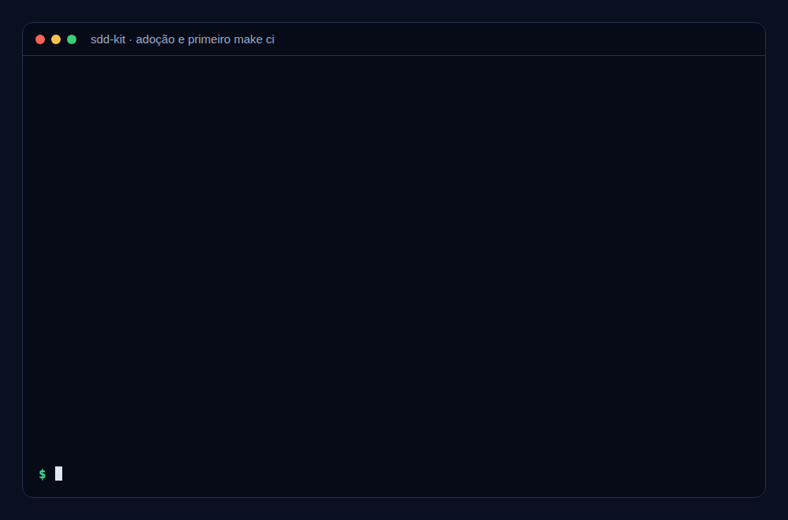
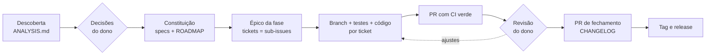

# sdd-kit

[](https://github.com/fabiodrneles/sdd-kit/actions/workflows/ci.yml)
[](LICENSE)
[English](README.en.md)

**Spec Driven Development do primeiro commit até a release**, conduzido pelo [Claude Code](https://claude.com/claude-code) e entregue do jeito que um time profissional entrega: specs com critérios de aceite, épico por fase, um ticket por tarefa, uma branch e um PR por ticket, CI verde, revisão, CHANGELOG e tag.

> **O dono decide, o agente executa.** Você responde às decisões e revisa os PRs; o agente analisa, especifica, abre os tickets, escreve código e testes e mantém o CI verde.



*A adoção num repositório vazio e o primeiro `make ci`, com a saída real ([como foi gerado](docs/demo/demo.sh)).*

O kit nasceu do [cv-craft](https://github.com/fabiodrneles/cv-craft), que saiu de protótipo para `v1.x` com esse processo ([estudo de caso](docs/case-study.md)), e o próprio sdd-kit é desenvolvido com ele ([specs](specs/README.md), [épico #1](https://github.com/fabiodrneles/sdd-kit/issues/1)). Para ver o processo num projeto criado do zero, com épico, tickets, PRs e release, abra o [sdd-kit-demo](https://github.com/fabiodrneles/sdd-kit-demo).

## Sumário

- [O que vem no kit](#o-que-vem-no-kit)
- [Como funciona](#como-funciona)
- [Começar num repositório novo](#começar-num-repositório-novo)
- [Adotar num repositório existente](#adotar-num-repositório-existente)
- [Onde está o ganho](#onde-está-o-ganho)
- [Por que o sdd-kit](#por-que-o-sdd-kit)
- [Comandos e verificações](#comandos-e-verificações)
- [Motor orientado a eventos](#motor-orientado-a-eventos)
- [Atualização automática](#atualização-automática)
- [Instalar a skill](#instalar-a-skill)
- [Script de adoção](#script-de-adoção)
- [Perguntas frequentes](#perguntas-frequentes)
- [Contribuir](#contribuir)

## O que vem no kit

| Parte | Para quê | Spec |
|---|---|---|
| Skill `sdd-delivery` | Ensina o agente o processo inteiro: análise com evidências, specs, épicos, PRs, CI vermelho tratado pela causa raiz, revisão, fechamento de fase e release. Escrita em inglês, escreve specs, issues e PRs no idioma do dono | [002](specs/002-skill-plugin/spec.md) |
| `template/` | `CLAUDE.md`, hook de sessão, templates de issue e PR, `CONTRIBUTING.md`, `CHANGELOG.md`, esqueleto de `specs/` e CI pronto para **Go, Node/TS, Java, Python, Rust e C#/.NET** | [003](specs/003-template/spec.md) |
| Script de adoção | Copia o template para um repositório novo ou existente **sem sobrescrever nada**; sh e PowerShell | [004](specs/004-adoption-script/spec.md) |

## Como funciona



| Etapa | Quem | O que fica no repositório |
|---|---|---|
| Descoberta | Agente | `specs/ANALYSIS.md`: o que foi verificado (comando → resultado), achados por severidade com evidência, decisões em aberto D1..Dn com recomendação |
| Decisões | **Dono** | Respostas registradas nas specs; nada é implementado antes |
| Specs | Agente | `specs/constitution.md` (princípios verificáveis), uma spec por área com `FR-*`, `NFR-*` e `AC-*` (Dado/Quando/Então), `ROADMAP.md` por fases e versões |
| Planejamento | Agente | Um épico por fase e um ticket por tarefa, como sub-issues nativas do GitHub |
| Implementação | Agente | Uma branch e um PR por ticket; cada `AC-*` vira teste; `make ci` verde antes de todo push |
| Revisão e merge | **Dono** | Revisão na ordem do épico; o agente responde e corrige |
| Fechamento | Agente → **Dono** | PR de fechamento (status das specs, ROADMAP, CHANGELOG); o dono cria a tag e o workflow publica a release |

O **estado do trabalho vive no GitHub**, não na conversa: o épico guarda um comentário "Estado da fase" com PRs, CI, decisões e próximo passo. Uma sessão nova lê esse comentário e continua de onde parou.

## Começar num repositório novo

Em uns 5 minutos o kit está instalado e o agente trabalhando no seu projeto.

**Você precisa de:** git, um repositório no GitHub e o [Claude Code](https://claude.com/claude-code) instalado. Para o CI passar na sua máquina, também a linguagem do projeto.

1. Crie o repositório no GitHub e clone.
2. Na pasta do projeto, instale o kit, trocando `go` pela linguagem do projeto (`node`, `java`, `python`, `rust` ou `dotnet`):

   ```text
   curl -fsSL https://raw.githubusercontent.com/fabiodrneles/sdd-kit/v1.6.0/scripts/adopt.sh | sh -s -- --lang go .
   ```

   O comando copia para o repositório:

   - as instruções para o agente (`CLAUDE.md` e `AGENTS.md`);
   - a pasta `specs/`, onde ficam o planejamento e as decisões, e o `CHANGELOG.md`;
   - o CI pronto para a linguagem (lint, testes com cobertura mínima e build) e o `Makefile` com o `make ci`;
   - os modelos de issue e de PR e o hook que prepara as sessões do Claude Code na web.

   **Ele nunca sobrescreve um arquivo que você já tem** e mostra no final o que criou e o que deixou de lado. Para só ver o que ele faria, sem gravar nada, acrescente `--dry-run`:

   ```text
   curl -fsSL https://raw.githubusercontent.com/fabiodrneles/sdd-kit/v1.6.0/scripts/adopt.sh | sh -s -- --lang go --dry-run .
   ```

   Num repositório vazio, `--skeleton` cria também um projeto mínimo com um teste, para o primeiro CI já nascer verde.

3. Faça o commit do que foi criado e abra o Claude Code na pasta do projeto.
4. Peça: *"use a skill sdd-delivery: crie a constituição, as specs e o ROADMAP para a minha ideia: …"*. O agente propõe as decisões em aberto e **para** até você responder.
5. Depois das respostas: *"crie o épico da Fase 1 com os tickets e siga ticket a ticket"*. Cada tarefa vira um PR pequeno, com CI verde, para você revisar.

## Adotar num repositório existente

O caminho é o mesmo script, e ele foi feito para não estragar nada:

- arquivos que já existem (`README.md`, `CLAUDE.md`, CI…) **nunca são sobrescritos** sem `--force`; o relatório lista o que foi criado e o que foi ignorado;
- `--dry-run` mostra tudo antes de escrever;
- rodar de novo não muda nada (idempotente).

```text
cd meu-repo
sh /caminho/do/sdd-kit/scripts/adopt.sh --lang node --dry-run .
sh /caminho/do/sdd-kit/scripts/adopt.sh --lang node .
```

Depois peça ao agente a **fase de descoberta**: *"use a skill sdd-delivery: analise e verifique este repositório"*. Ele lê o código, roda o que o README promete, registra os achados com evidência em `specs/ANALYSIS.md` e propõe as decisões. A partir daí o fluxo é o mesmo de um repositório novo.

### Como a skill chega a cada repositório

A skill **não é copiada** para os repositórios. Ela é publicada como plugin do Claude Code neste repositório, e cada projeto só declara que usa o plugin:

```json
{
  "extraKnownMarketplaces": {
    "sdd-kit": { "source": { "source": "github", "repo": "fabiodrneles/sdd-kit" } }
  },
  "enabledPlugins": { "sdd-delivery@sdd-kit": true }
}
```

Repositórios adotados pelo script já recebem essa configuração; se o seu já tinha um `.claude/settings.json`, o script não o altera e basta acrescentar as duas chaves acima. Uma melhoria na skill feita aqui chega a todos os repositórios, sem cópias divergentes. O que é do projeto (specs, `CLAUDE.md`, CI) continua no projeto. O [cv-craft](https://github.com/fabiodrneles/cv-craft) já funciona assim.

## Onde está o ganho

| Problema comum com agentes | Como o kit resolve |
|---|---|
| O agente "esquece" o projeto a cada sessão e relê tudo | `CLAUDE.md` com mapa e armadilhas + comentário "Estado da fase" no épico: a retomada lê um comentário, não o repositório inteiro |
| A sessão acaba no meio (limite de uso, contexto cheio) e o trabalho se perde | **Checkpoints de retomada:** a cada passo, o agente grava no épico onde parou (branch, commit, PRs, próximo passo); a sessão seguinte o lê sozinha ao abrir e continua, sem você explicar nada |
| Gasto de tokens com leitura e validação | A skill orienta a ler trechos, pedir só o resumo do CI e validar tudo num comando (`make ci`) |
| Código que "parece pronto" mas não cumpre o pedido | Critérios de aceite verificáveis; cada `AC-*` vira teste; mutação de cada teste novo |
| PRs gigantes e difíceis de revisar | Um ticket = uma branch = um PR, com ordem de revisão no épico |
| CI vermelho "resolvido" desligando teste | Regra explícita: causa raiz, nunca pular teste ou afrouxar gate |
| Decisões tomadas pelo agente sem você saber | Pontos de parada: decisões, revisão, merge e tag são do dono |
| Ferramentas instaladas no meio do trabalho | Hook de sessão instala as ferramentas do CI na versão certa |

## Por que o sdd-kit

A comunidade já tem ótimas ferramentas de SDD, e cada uma brilha num ponto:

| Ferramenta | Melhor em | Foco |
|---|---|---|
| [spec-kit](https://github.com/github/spec-kit) (GitHub) | Projetos novos e times que querem um fluxo padrão | `constitution` → `specify` → `plan` → `tasks` → `implement`, para vários agentes |
| [OpenSpec](https://github.com/Fission-AI/OpenSpec) | Mudanças em código existente | Propostas de mudança com deltas (`ADDED`/`MODIFIED`/`REMOVED`) arquivadas nas specs |
| [Kiro](https://github.com/kirodotdev/Kiro) (AWS) | Experiência integrada na IDE | `requirements.md` em notação EARS, `design.md`, `tasks.md` e hooks |
| [BMAD Method](https://github.com/bmad-code-org/BMAD-METHOD) | Projetos grandes e regulados | Time ágil simulado com papéis (analista, PM, arquiteto, QA…) |

O **sdd-kit** cobre o trecho que essas ferramentas deixam para você: **a entrega**. A spec vira épico e tickets no GitHub, cada ticket vira um PR revisável com CI verde, a fase fecha com CHANGELOG e a release sai de uma tag. Tudo com papéis claros (o dono decide), **checkpoints de retomada** (feche a sessão a qualquer momento; a próxima continua sozinha de onde a anterior parou) e CI pronto por linguagem. E o kit incorpora o melhor delas ([spec 006](specs/006-community-features/spec.md)): critérios em EARS (Kiro), deltas `ADDED`/`MODIFIED`/`REMOVED` por spec (OpenSpec), checagem de rastreabilidade AC → teste e comandos de barra (spec-kit), e `AGENTS.md` para outros agentes.

## Comandos e verificações

Com o plugin instalado, cada etapa do fluxo tem um comando:

| Comando | Faz |
|---|---|
| `/sdd-analyze` | Descoberta: `specs/ANALYSIS.md` com evidências e decisões; para e espera o dono |
| `/sdd-specs` | Constituição, specs e ROADMAP a partir das decisões |
| `/sdd-epic <fase>` | Épico da fase com os tickets como sub-issues |
| `/sdd-next` | Próximo ticket do épico até um PR com CI verde |
| `/sdd-status` | Comentário "Estado da fase" no épico (para retomar em qualquer sessão) |
| `/sdd-close <versão>` | PR de fechamento (status das specs, ROADMAP, CHANGELOG); a tag fica com o dono |

Nos repositórios adotados:

- **`make ci`**: a mesma verificação do CI da linguagem, com cobertura mínima.
- **Workflow Release tag**: *Actions → Release tag → Run workflow* cria a tag (calculada pelos Conventional Commits com o [go-release-manager](https://github.com/fabiodrneles/go-release-manager), ou a do ROADMAP em `release-as`) e publica a release com as notas geradas.
- **`make sdd-check`**: rastreabilidade. Todo critério de aceite de spec `In Progress`/`Done` precisa ser citado num teste como `NNN AC-n` (ex.: `// 003 AC-2`), o status das specs bate com o índice e o ROADMAP só cita IDs que existem. No CI e no `make sdd-check`, roda com `--strict`: um aviso bloqueia o merge.
- **Critérios de aceite** em Dado/Quando/Então ou em **EARS** (`QUANDO <gatilho>, O SISTEMA DEVE <resposta>`).
- **Seção "Mudanças"** em cada spec (`ADDED`/`MODIFIED`/`REMOVED` + ID), que vira o CHANGELOG no fechamento da fase.
- **`make linkcheck`** (links quebrados nos `.md`, com o lychee) e **`scripts/doc-commands.sh`**, que roda no CI os blocos `bash` do README marcados com `<!-- doc-commands -->`.
- **Acessibilidade no template Node:** com `A11Y_PAGES := dist/index.html`, o `make ci` roda o axe nas páginas e falha em qualquer violação.
- **`AGENTS.md`**, para Codex, Copilot, Cursor e outros agentes seguirem o mesmo processo.

### Scripts que poupam tokens

A adoção também traz scripts para os passos mecânicos do processo. O agente chama o script e lê uma linha por resultado, em vez de executar dezenas de passos e ler saídas longas:

| Script | Faz |
|---|---|
| `scripts/sdd-ci.sh [#PR\|SHA]` | Espera o CI e mostra só o fim do log dos checks que falharam |
| `scripts/sdd-wait.sh pr-merged\|ci\|issue-closed ALVO` | Espera, sem LLM, um PR ser mergeado, o CI terminar ou uma issue fechar; uma linha no fim e código de saída (0 valeu, 1 falhou, 2 tempo esgotado). Para esperar em segundo plano, nunca um laço à mão |
| `scripts/sdd-pr.sh [--spec NNN] [--dry-run]` | Entrega a branch do ticket: merge da `main`, `make ci`, push, PR (ou reaproveita o aberto), CI do PR e checkpoint |
| `scripts/sdd-doctor.sh [--check]` | Confere e conserta o ambiente local para o `make ci` valer como o CI (ferramentas nas versões do Makefile, `covdata`, `golangci-lint` ofuscado no PATH, locale UTF-8); uma linha por item, `--check` só relata |
| `scripts/sdd-release.sh [X.Y.Z] [--dry-run]` | PR de fechamento da versão (versão calculada pelo go-release-manager; X.Y.Z só força): rascunho do CHANGELOG pelos PRs mesclados, versões do `.sdd-release`, commit e PR; `--tag` depois do merge dispara o *Release tag* ou cria a tag |
| `scripts/sdd-mark.sh decide D1=a` | Registra as decisões do dono e aprova as specs |
| `scripts/sdd-mark.sh close vX.Y.Z` | Arquivos de status do fechamento da fase (specs, ROADMAP, CHANGELOG) |
| `scripts/sdd-phase-status.sh [--post]` | Comentário "Estado da fase" do épico |
| `scripts/sdd-epic.sh [--dry-run] N` | Épico da fase N e os tickets como sub-issues |
| `scripts/sdd-checkpoint.sh save\|show` | Checkpoint de retomada no épico: uma sessão nova continua sozinha de onde a anterior parou |
| `scripts/sdd-resume.sh` | Retomada em um comando: checkpoint, branch, PRs abertos com CI e issues abertas do épico |
| `scripts/sdd-release-check.sh pre\|post vX.Y.Z` | Go: simula o release antes da tag e confere a release publicada |

## Motor orientado a eventos

Cada evento de PR que acordava a sessão do agente (CI, merge, conflito) recarregava a conversa inteira só para fazer um passo mecânico. A adoção traz workflows que fazem esses passos sem LLM; o agente abre o PR (`sdd-pr.sh --no-wait`), grava o checkpoint e encerra a resposta, e volta só quando há julgamento (código, causa raiz, conflito real, revisão).

| Evento | Workflow | O que faz, sem LLM |
|---|---|---|
| PR de ticket mergeado | `sdd-on-merge.yml` | Atualiza o checkpoint do épico: feito é o PR, próximo é o menor sub-issue aberto |
| CI de um PR termina | `sdd-ci-summary.yml` | Mantém um único comentário com uma linha por check e o fim do log das falhas; vira "verde" quando passa |
| `main` muda | `sdd-update-prs.yml` | Traz a `main` (merge) para os PRs abertos atrás dela e avisa uma vez os que têm conflito real |
| Último ticket do épico fechado | `sdd-on-phase-done.yml` | Abre o PR de fechamento da versão (`sdd-release.sh`) |
| PR de fechamento mergeado | `sdd-on-release-merge.yml` | Dispara a release da versão uma única vez (`sdd-release.sh --tag`) |

Todos são idempotentes, usam só o `GITHUB_TOKEN` (ou o segredo opcional abaixo), sem segredos de LLM, e só agem em PRs do próprio repositório. O `sdd-wait.sh` cobre o que sobrar para esperar num shell. O próprio sdd-kit roda esse motor (`make self-sync` gera os workflows dele a partir do template e o CI falha se divergirem).

Configuração do repositório:

1. **Obrigatório para o fechamento automático e para o `sdd-sync`:** *Settings → Actions → General → Workflow permissions* → marque **"Allow GitHub Actions to create and approve pull requests"**. Sem isso, o `sdd-on-phase-done` não abre o PR de fechamento e o `sdd-sync` falha com "GitHub Actions is not permitted to create or approve pull requests".
2. **Opcional:** o segredo `SDD_ENGINE_TOKEN`, um token fine-grained com permissão de escrita em *Contents* e *Pull requests*. Pushes e PRs feitos com o `GITHUB_TOKEN` não disparam o CI; com o segredo, os que o motor faz disparam.
3. **Desligar:** a variável de repositório `SDD_ENGINE=off` desliga todos os workflows do motor (nenhum lê nem escreve nada).
4. **Nome do CI:** o resumo escuta o workflow chamado `CI`. Se o projeto o renomeou, volte o nome ou ajuste `workflows:` em `sdd-ci-summary.yml`.

## Atualização automática

A adoção grava `.sdd-kit.json` (versão do kit e o hash de cada arquivo gerenciado). Toda segunda-feira, o workflow `sdd-kit sync` compara com a última release e abre **um PR** com as atualizações:

- arquivos que você não alterou são atualizados;
- arquivos que o kit não mudou ficam como estão, mesmo se você os alterou;
- se você e o kit mudaram o mesmo arquivo, o PR traz a versão nova e lista o arquivo em **"Conflitos"**, para você decidir no próprio PR;
- arquivos que são só do seu repositório nunca são tocados;
- `specs/` e `CHANGELOG.md` são do projeto: o kit os cria na adoção, se faltarem, e nunca mais os altera.

Quando a versão nova cria ou muda arquivos em `.github/workflows/`, o `GITHUB_TOKEN` não consegue enviá-los (ele nunca recebe a permissão `workflows`). Sem o segredo **`SDD_SYNC_TOKEN`**, o PR traz tudo menos esses workflows, e a descrição os lista com o que fazer: configurar o segredo (token fine-grained com *Contents*, *Pull requests* e *Workflows* em escrita; o `SDD_ENGINE_TOKEN`, se tiver a permissão *Workflows*, também serve) ou rodar `sh scripts/sdd-sync.sh --only-workflows` na branch do PR e enviar o resultado.

Para o workflow abrir PRs, ative em *Settings → Actions → General* a opção **"Allow GitHub Actions to create and approve pull requests"**. Sem ela, o job envia a branch `sdd-kit/sync`, grava no resumo o link para abrir o PR e termina com um aviso, não com falha.

Quem adotou até a `v1.3.0` e vê a sincronização falhar com `Syntax error`: o script antigo se sobrescrevia enquanto rodava. Rode uma vez uma cópia dele, na raiz do repositório, e abra o PR com o resultado: `cp scripts/sdd-sync.sh /tmp/sdd-sync.sh && sh /tmp/sdd-sync.sh`. Da `v1.3.1` em diante, o próprio script faz isso.

## Instalar a skill

No Claude Code:

```text
/plugin marketplace add fabiodrneles/sdd-kit
/plugin install sdd-delivery@sdd-kit
```

### Plugin `sdd-release` (opcional)

Calcula a próxima versão SemVer pelos Conventional Commits, com o [go-release-manager](https://github.com/fabiodrneles/go-release-manager), e propõe o fechamento da fase com ela:

```text
/plugin install sdd-release@sdd-kit
/sdd-release
```

A tag continua sendo do dono. Se quiser criá-la pelo GitHub, copie o modelo [`release-tag.yml`](plugins/sdd-release/templates/release-tag.yml) para `.github/workflows/` e dispare-o em *Actions → Release tag → Run workflow*. Ele chama o `release.yml` do GoReleaser; projetos sem binários usam o `release-tag.yml` que a adoção já instala.

No claude.ai: baixe `sdd-delivery.zip` da [última release](https://github.com/fabiodrneles/sdd-kit/releases) e envie em *Configurações → Capacidades → Skills*.

## Script de adoção

```text
sh scripts/adopt.sh --lang go|node|java|python|rust|dotnet [opções] [DESTINO]
pwsh -File scripts/adopt.ps1 --lang go|node|java|python|rust|dotnet [opções] [DESTINO]
```

| Opção | Efeito |
|---|---|
| `--lang` | `go`, `node`, `java` ou `python` (obrigatório) |
| `--project` | Nome do projeto (padrão: nome do diretório) |
| `--owner`, `--repo` | Dono e repositório no GitHub (padrão: deduzidos do `origin`) |
| `--dry-run` | Mostra o que seria feito, sem escrever |
| `--force` | Sobrescreve arquivos existentes |
| `--skeleton` | Num repositório vazio, cria um projeto mínimo com um teste (`go.mod`, `package.json`, `pyproject.toml` ou `pom.xml`), para o primeiro push já ter o CI verde. Nunca sobrescreve, nem com `--force` |

O que cada linguagem recebe:

| Linguagem | `make ci` roda | CI |
|---|---|---|
| Go | golangci-lint, `go test -race` com cobertura, `go build` | `setup-go` pelo `go.mod` |
| Node/TS | `lint` e `build` (se existirem), `test` medido pelo [c8](https://github.com/bcoe/c8) | Node LTS, `npm ci` |
| Java | Maven: `mvn verify` (ou `./mvnw`); Gradle: `gradle check` (ou `./gradlew`). JaCoCo nos dois, sem mudar o `pom.xml` nem o `build.gradle` | Temurin 21, cache do Maven ou do Gradle |
| Python | `ruff check`, `ruff format --check`, `pytest` com `pytest-cov` (no extra `dev`) | Python 3.12, extra `dev` |
| C#/.NET | `dotnet format --verify-no-changes`, `dotnet build -warnaserror`, `dotnet test` com o coverlet.collector | .NET 8 |
| Rust | `cargo fmt --check`, `cargo clippy -D warnings`, `cargo llvm-cov` (o `make deps` instala) | Rust estável, `cargo-llvm-cov` |

Em todas, o `make ci` **falha com cobertura de linhas abaixo de `COVERAGE_MIN`** (80 por padrão, configurável no `Makefile`) e mostra a cobertura medida. Arquivos que nenhum teste carrega também contam.

Todo template é testado no CI do kit: o script adota cada linguagem num projeto mínimo, roda o `make ci` gerado e confere que um arquivo sem testes faz o `make ci` falhar pela cobertura.

## Perguntas frequentes

**Preciso usar o Claude Code?** A skill foi escrita para ele. O template (specs, CI, templates de issue e PR) serve para qualquer time, com ou sem agente.

**Funciona com monorepo ou outra linguagem?** Use `--lang` com a linguagem principal e ajuste o `Makefile`; novas linguagens entram como tickets próprios ([ROADMAP](specs/ROADMAP.md)).

**O agente faz merge sozinho?** Não. Merge, tag e release são do dono, salvo delegação explícita para uma rodada.

**E se eu já tenho `CLAUDE.md` ou CI?** O script não toca neles e lista no relatório; a fase de descoberta propõe como integrar.

## Contribuir

O kit é desenvolvido com o próprio processo: [constituição](specs/constitution.md), [specs](specs/README.md), [CLAUDE.md](CLAUDE.md). O passo a passo está em [CONTRIBUTING.md](CONTRIBUTING.md); veja também o [código de conduta](CODE_OF_CONDUCT.md) e a [política de segurança](SECURITY.md). Antes de todo push:

```text
make ci
```

## Licença

[MIT](LICENSE)
